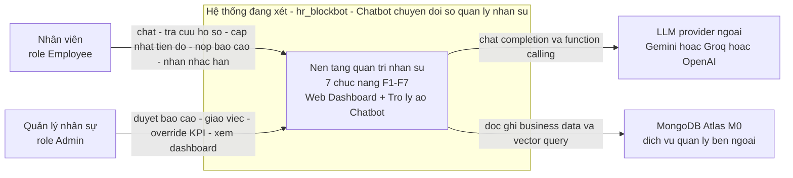
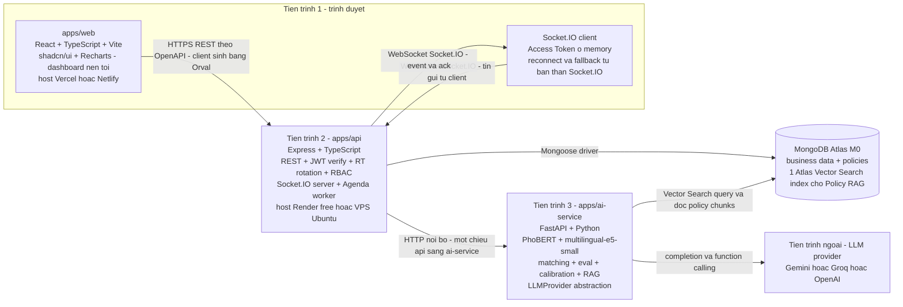
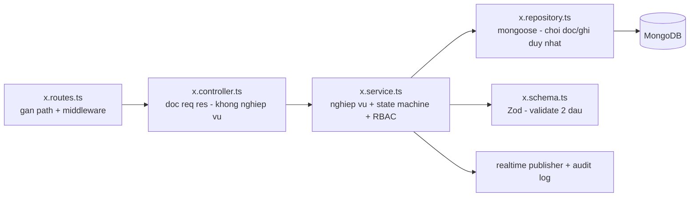
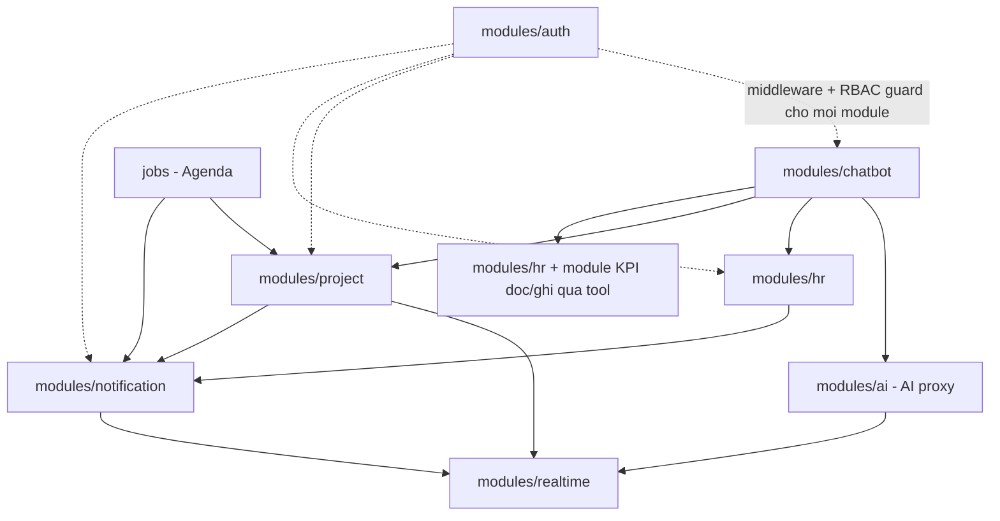

# 02 — Kiến trúc hệ thống (KLCN133)

**Dự án:** *Xây dựng Chatbot chuyển đổi số quản lý nhân sự* — khóa luận cử nhân CNTT (HUIT), 12 tuần,
24/08/2026 → 16/11/2026, nhóm 3 người.

**Ngày viết:** 13/09/2026 · **Trạng thái:** baseline kiến trúc, chốt sau vòng research B0–B15.

**Nguồn duy nhất của tài liệu này:**
`docs/research/NOTES-01.md` (mục "Kết luận kiến trúc sau vòng research" + B1, B2, B3, B6, B7, B8, B9, B10, B15)
và `docs/research/RESEARCH-PLAN.md` §1 (ràng buộc đề cương), §2 (danh mục docs), §11 (fitness functions),
cùng `README.md`. Không có thông tin nào ngoài ba nguồn này; chỗ nào thiếu số liệu thì file ghi rõ
`[CẦN NGUỒN]` thay vì đoán.

> **Cảnh báo về nguồn số:** `NOTES-01.md` dòng 6–9 ghi rõ **URL của các dòng "Nguồn Atlas / Render /
> Vercel / Netlify" bị mất khi paste**, và mục "CẦN BỔ SUNG" (dòng 545–556) còn treo 4 mục. Mọi con số
> hạ tầng trong bài này được **chép nguyên văn từ `NOTES-01.md`** và **chưa được đối chiếu lại với tài liệu
> chính thức**. Không con số nào được phép đưa vào báo cáo trước khi nhóm bổ sung URL.

**Xem thêm:** `docs/03-decision-records/` (ADR-001 → ADR-016, mục tiêu ở §11 cuối file này).

---

## 1. Bối cảnh và ràng buộc

### 1.1 Ràng buộc cứng từ đề cương (đầu bài — `RESEARCH-PLAN.md` §1)

| Nhóm | Ràng buộc | Hệ quả kiến trúc |
|---|---|---|
| Scope | 7 chức năng: F1 hồ sơ / phòng ban / 5 cấp bậc · F2 vòng đời đề tài · F3 chatbot tra cứu · F4 gợi ý phân công PhoBERT · F5 phân tích ngữ nghĩa nhận xét → KPI · F6 dashboard · F7 báo cáo nghiệm thu + nhắc hạn | Kiến trúc phải có đủ: tầng REST nghiệp vụ, tầng realtime, tầng AI (matching + RAG + sentiment), tầng scheduler |
| Stack | **MERN + TypeScript**; lõi AI **Python/FastAPI**; Socket.IO; **pnpm monorepo**; CI/CD; **MongoDB Atlas M0**; **Render/VPS Ubuntu**; **Vercel/Netlify** | Sơ đồ lớp ở §2 là khung bị khoá bởi đề cương, không phải lựa chọn tự do |
| Auth | JWT + Refresh Token Rotation; RBAC Admin/Employee | `apps/api` là điểm duy nhất phát hành/hủy token (ADR-007, ADR-008, ADR-009) |
| Chatbot | Intent detection, Function Calling, Agent Loop, tra cứu KPI + hỏi đáp chính sách, realtime qua WebSocket | Tool catalog + guard ở `08-algorithms.md`; hợp đồng event ở `06-api-spec.md` (ADR-010) |
| AI metric | **F1-score ≥ 85%** + Accuracy trên tập test chuẩn | Hàng rào eval tự động trong CI (ADR-016). **Đang treo:** F1 đo trên bài toán nào — `RESEARCH-PLAN.md` §7.2, `NOTES-01.md` §B5 dòng 266–269 |
| UI | Dashboard **nền tối**, biểu đồ biến động KPI | shadcn/ui + Recharts (ADR-015) |
| Kiểm thử | Postman (API), Lighthouse (giao diện), eval mô hình, UAT với giảng viên + sinh viên đóng vai | Bộ gate ở §9 |
| Tiến độ | 12 tuần, 3 SV, gặp GVHD ≥ 1 lần/tuần | Ưu tiên stack ít khớp nối — lý do của ADR-001, ADR-002, ADR-010, ADR-011 |

### 1.2 Trần hạ tầng thực tế (`NOTES-01.md` §B1, dòng 108–143)

| Service | Thực tế hiện tại (nguyên văn NOTES-01) | Ảnh hưởng ghi nhận ở B1 |
|---|---|---|
| MongoDB Atlas Free | 0.5 GB, tối đa 500 connections, 100 DB, 500 collections, ~100 ops/s, không backup tự động | đủ đồ án/demo, không dùng như production thật |
| Atlas Search / Vector | Free tier có Search/Vector Search, tối đa 3 index | RAG policy chạy được |
| Render Free | WebSocket được hỗ trợ; sleep sau 15 phút không có HTTP/WS traffic; wake-up có thể ~1 phút | demo được, realtime không luôn tức thì |
| Vercel | từ 22/06/2026 WebSocket ở Public Beta, hỗ trợ cả Socket.IO | frontend + WS có thêm phương án mới |
| Netlify Functions | serverless/streaming tốt, nhưng không phải lựa chọn ưu tiên cho Socket.IO backend chính | dùng frontend tốt hơn |

Hai giới hạn ở trên **định hình thiết kế** chứ không chỉ là ghi chú: quota 3 index bị dùng đúng 1 (ADR-005),
và "sleep 15 phút" bị đẩy thẳng vào trải người dùng (xem §6, hàng `apps/api`).

### 1.3 Ràng buộc tự áp (nguyên tắc, không phải đề cương)

`NOTES-01.md` dòng 530–531 chốt: **không thêm ở baseline** NestJS · Redis · BullMQ · Turborepo · Qdrant ·
LangChain/LangGraph · microservice phức tạp · Kubernetes — "chưa tạo đủ giá trị cho nhóm 3 người / 12 tuần".
Danh sách đầy đủ + lý do ở §10.

`RESEARCH-PLAN.md` §11 là luật thiết kế cho mọi mục có gate: **"không thêm gate nào nếu chưa có lệnh
chạy nó trong CI."** Tài liệu này tuân thủ nghiêm: §9 chỉ liệt kê gate có lệnh.

---

## 2. Quan kiến trúc — sơ đồ lớp đã chốt

`NOTES-01.md` dòng 505–528, "Kết luận kiến trúc sau vòng research":

```text
React + TypeScript + shadcn/ui + Recharts
                │
                ▼
       Express + TypeScript
       ├── JWT / RT rotation
       ├── RBAC
       ├── Socket.IO
       ├── Agenda
       └── MongoDB Atlas
                │
                ▼
         FastAPI Python
         ├── PhoBERT
         ├── multilingual-e5-small
         ├── matching/eval
         └── calibration
                │
                ▼
             LLM
      Gemini / Groq / provider abstraction
```

Bốn tầng này tương ứng bốn **tiến trình** (không phải bốn container độc lập về scaling): một tiến trình
trình duyệt, một tiến trình Node, một tiến trình Python, và hai dịch vụ ngoài (Atlas, LLM provider).
Agenda **nằm trong** tiến trình Express, không phải process riêng (ADR-011).

---

## 3. C4 Level 1 — System Context



*(Nhãn trong sơ đồ viết không dấu để tránh ký tự phá Mermaid parser; nội dung thuật ngữ giữ nguyên tiếng Việt có dấu ở văn xuôi.)*

**Giải thích biên:**

- **Hai vai, đúng hai role.** `NOTES-01.md` §B3 dòng 205: `role = Admin | Employee → quyền hệ thống`.
  Không có role thứ ba ở baseline; `level = Intern | Junior | Middle | Senior | Lead` là **trục dữ liệu
  nghiệp vụ**, không phải quyền (ADR-009).
- **Chatbot là kênh, không phải hệ thống con tách rời.** `README.md` dòng 5–7 mô tả Dashboard và Chatbot
  nối nhau qua AI + WebSocket; `NOTES-01.md` §B7 dòng 365 ghi "Không cần 2 namespace ngay."
- **LLM provider là hệ thống ngoài, có thể thay.** `NOTES-01.md` §B6 dòng 300–306 định nghĩa
  `LLMProvider interface` với ba implementation (ADR-012). Đây cũng là lý do biên này là biên **duy nhất**
  đi ra khỏi vùng kiểm soát của nhóm về phía model thương mại.
- **MongoDB Atlas là dịch vụ quản lý ngoài**, nhưng là state store duy nhất của hệ thống — kể cả job queue
  của Agenda (ADR-011).
- **Ràng buộc chưa chốt:** đề cương có cho phép gửi dữ liệu nhân sự ra LLM ngoài không —
  `RESEARCH-PLAN.md` §7.5, chưa có trả lời. `[CẦN NGUỒN]`

---

## 4. C4 Level 2 — Container



**Tiến trình, không phải bản sao:** mỗi ô trên là **một** process đang chạy. `apps/api` chạy **một instance**
— đó là lý do không cần Redis adapter (ADR-010) và không cần sticky session ở tầng này. Cạnh WebSocket được vẽ
thành hai mũi tên một chiều (client gửi / server đẩy) thay vì một cạnh hai đầu. `Agenda` không xuất hiện như
một ô riêng vì nó là **thành phần trong** `apps/api` (ADR-011).

> *Về ký hiệu:* cạnh `AISP --> LLM` vẽ theo sơ đồ lớp ở §2 (LLM đặt dưới FastAPI). Trên hình, `apps/ai-service`
> mới là ô chạm provider; điều đó **không** ngụ ý agent loop nằm trong Python — vị trí thật của loop/tool
> runtime là điểm treo #4 ở §12 và **chưa được quyết**.

**Cây thư mục monorepo tương ứng** (`NOTES-01.md` §B2 dòng 153–173):

```text
root/
├─ apps/
│  ├─ web/          # React + TS + shadcn/ui + Recharts
│  ├─ api/          # Express + TS + Socket.IO + Agenda
│  └─ ai-service/   # FastAPI + Python: PhoBERT, matching, eval, calibration
├─ packages/
│  ├─ contracts/    # Zod schema → OpenAPI → Orval client
│  ├─ config/
│  └─ eslint-config/
├─ docs/
├─ pnpm-workspace.yaml
└─ package.json
```

---

## 5. C4 Level 3 — Component bên trong `apps/api`

### 5.1 Luật phân lớp (mọi module tuân thủ một hình duy nhất)



`NOTES-01.md` §B2 dòng 167–173 chốt khung file của một module (`auth.controller.ts` / `auth.service.ts` /
`auth.repository.ts` / `auth.schema.ts` / `auth.routes.ts`); `RESEARCH-PLAN.md` §3 B2 gọi tên luật là
"thin controller → service → repository". **Không có mũi tên ngược**: repository không gọi service, service
không import `express`/`Response`.

Rule mà CI giữ (`RESEARCH-PLAN.md` §11): **`domain/` không import `mongoose`/`express`**;
`ai-service` không import model của API; không circular deps. Nội dung thuần nghiệp vụ (state machine F2,
lượng hoá KPI, quy tắc overtime-derived) nằm ở `domain/`, nhận persistence qua interface do repository cài.

### 5.2 Bảy module theo feature

| Module | Trách nhiệm | Bằng chứng trong NOTES-01 |
|---|---|---|
| `modules/auth` | login/logout, access token, refresh rotation + reuse detection, `refresh_sessions`, password Argon2id, RBAC guard | §B3 dòng 182–209 |
| `modules/hr` | hồ sơ nhân viên, phòng ban, kỹ năng, 5 cấp bậc `level`; `employeeCode` UNIQUE | §B4 dòng 218, 240; §B3 dòng 206 |
| `modules/project` | vòng đời đề tài F2: `DRAFT → ASSIGNED → IN_PROGRESS → PENDING_REVIEW → COMPLETED` + nhánh reject; `status` + `version` + `updatedAt` + `statusHistory[]`; overdue là **dẫn xuất** | §B4 dòng 225–235; §B1 dòng 134–141 |
| `modules/chatbot` | intent catalog → tool mapping, agent loop, guard, tool catalog read/write, confirm-before-write | §B0 dòng 49–90; §B6 dòng 308–330 |
| `modules/ai` (AI proxy) | biên giới Node→Python: gọi `ai-service`, zod-validate payload, **không** đặt business logic ở đây | §B6 dòng 298–306; kết luận dòng 507–528 |
| `modules/realtime` | Socket.IO gateway, rooms `user:<userId>` / `department:<departmentId>`, `clientMessageId` chống trùng | §B7 dòng 358–366 |
| `modules/notification` | notification matrix, dedup "1 lần/ngày", digest, persist notification phía app | §B0 dòng 92–104; §B7 dòng 364–365 |
| `jobs/` (Agenda) | quét item sắp hạn, job survive restart, chống spam, phát sự kiện vào `realtime` | §B15 dòng 480–484; §B0 UF-09 dòng 44 |

### 5.3 Hướng phụ thuộc giữa các module



Hai chiều đi **từ** `realtime`: đây là hệ quả trực tiếp của việc chọn Socket.IO single-instance
(ADR-010) — mọi module đẩy event qua một publisher duy nhất thay vì mỗi module tự giữ socket.
Đường `chatbot → ai` là **một chiều**; `ai-service` không gọi ngược lại `apps/api` ở baseline — vị trí
chính xác của agent loop/tool runtime đang treo, xem §12.

---

## 6. Bảng Container responsibility

| Container | Công nghệ | Lý do chọn | Trần hạ tầng áp lên nó (`NOTES-01.md` §B1) | Hệ quả thiết kế |
|---|---|---|---|---|
| `apps/web` (browser) | React + TypeScript + Vite + shadcn/ui + Recharts | Đề cương: MERN + TS; shadcn có semantic CSS variables (`background` `foreground` `card` `muted` `primary` `destructive` `chart-1..5`) và dark mode qua token/theme — hợp dashboard cần bản sắc riêng (§B8 dòng 371–374) | Vercel: WebSocket mới ở Public Beta từ 22/06/2026; Netlify Functions không phải lựa chọn ưu tiên cho WS backend | UI phải coi WS là **kênh tối ưu, không phải kênh đúng nhất**: notification vẫn đọc lại qua REST khi mount/reconnect. Chart không render dữ liệu chưa có trong cache khi app "ngủ" |
| Socket.IO client (browser) | `socket.io-client` | Đề cương bắt realtime; Socket.IO "tự hỗ trợ fallback và reconnect" (§B7 dòng 364) | Không có trần riêng ở client, nhưng bị trần của `apps/api` giới hạn: server có thể đang ngủ | Mỗi message mang `clientMessageId` để chống duplicate khi reconnect/retry (§B7 dòng 363–364); UX phải hiển thị trạng thái "đang kết nối lại" thay vì giả định tức thì |
| `apps/api` | Express + TypeScript + JWT/`jose` + Argon2id + Socket.IO + Agenda, **1 instance** | Express đã nằm trong đầu bài; NestJS cần GVHD xác nhận (§B2 dòng 150). Agenda dùng Mongo nên không phải dựng Redis (§B15 dòng 483–484) | Render Free: **sleep sau 15 phút không có HTTP/WS traffic, wake-up có thể ~1 phút**, WebSocket được hỗ trợ; Atlas: tối đa **500 connections**, **~100 ops/s** | **Chuỗi nhân quả quan trọng nhất của kiến trúc:** tiến trình đơn + ngủ đông ⇒ nhắc hạn **không tức thì** khi service đang ngủ ⇒ hệ thống không được thiết kế như "push ngay khi tới giờ". Thiết kế đúng là: notification **được persist** (ADR-010, §B7 dòng 364–365), client **đọc lại khi mở tab**, và reminder là "hàng đợi việc cần làm" chứ không phải tiếng chuông. Hệ quả phụ: mọi state transition phải là **atomic conditional update + `statusHistory[]`**, vì không được assumption về transaction liên document (ADR-004); connection budget 500 phải chia cho API + Agenda + `ai-service` ⇒ dùng **một connection pool duy nhất trong API**, không mở pool mới mỗi job |
| `apps/ai-service` | FastAPI + Python (`vinai/phobert-base` 135M params, `multilingual-e5-small` 384 dims, matching + calibration + RAG) | Đề cương: lõi AI Python/FastAPI; PhoBERT **bắt buộc** theo đề cương (§B5 dòng 262); eval cần hệ Python | Trần RAM/CPU **chưa được NOTES-01 trả lời** — `RESEARCH-PLAN.md` §3 B1 hỏi "VPS 2GB RAM có đủ chạy Node API + FastAPI + PhoBERT inference trên CPU không" nhưng vòng 1 chưa có đáp án: `[CẦN NGUỒN]` | Phải có warm embedding (`Warm embedding inference < 500 ms`, §B9) và fallback khi model lạnh. Biên giới service là chỗ **duy nhất** được phép trả kết quả embedding; mọi so sánh/điểm chuẩn hoá nằm trong `matching/eval` + `calibration` (S2/S3). Vì PhoBERT **yêu cầu input tiếng Việt đã word-segmented** (§B5), pipeline tiền xử lý là một phần của container này, không phải của chat UI |
| MongoDB Atlas M0 | managed MongoDB + 1 Atlas Vector Search index | Một state store duy nhất cho: business data, policies, refresh sessions, **và** job store của Agenda (§B1 dòng 122–127, §B15 dòng 483) | 0.5 GB · 500 connections · 100 DB · 500 collections · ~100 ops/s · **không backup tự động** · tối đa **3** Search/Vector index | Quota index bị dùng **1/3**, 2 index còn lại để trống có chủ đích cho thử nghiệm (ADR-005). "Không backup tự động" ⇒ seed phải tái lập được bằng mã (S14 `make demo`, gate "Dữ liệu tái lập" §9). Không có transaction liên document ⇒ schema chịu trách nhiệm bất biến (§B1 dòng 142: "Không thiết kế F2 dựa vào transaction nhiều collection") |
| LLM provider (ngoài) | Gemini 3.1 Flash-Lite (Free Tier, paid ~$0.25/1M input, $1.50/1M output) hoặc Groq Free (nhiều model ở 30 RPM; `gpt-oss-120b` ~1.000 RPD và 8K TPM) — abstraction qua `LLMProvider` | Không hard-code provider vào business logic (§B6 dòng 298–306) | Quota RPM/TPM/RPD của free tier, và **tính không ổn định** của live eval | Guard phải chặn trước khi chạm trần: `maxSteps = 5`, `toolTimeout`, `LLM timeout`, `max tool result size` (§B6 dòng 316). Hết quota là **trạng thái được thiết kế trước**, không phải sự cố — S9 graceful degradation rơi về pipeline PhoBERT-only. Live eval **không block PR** (ADR-016) |

---

## 7. Cross-cutting concerns

### 7.1 Auth flow (tóm tắt — chi tiết ở `07-auth-rbac.md`)

```text
LOGIN → Access Token + Refresh Token
  → Refresh → invalidate RT-1 → issue RT-2
  → RT-1 xuất hiện lại?  no → tiếp tục
                         yes → revoke TOÀN BỘ family
```

(`NOTES-01.md` §B3 dòng 192–196.) Ba bất biến của toàn hệ thống:

1. Access Token **ở memory**, Refresh Token ở cookie **HttpOnly + Secure + SameSite**, Mongo **chỉ lưu hash**
   (`tokenHash` UNIQUE, `expiresAt` TTL — §B3 dòng 198, §B4 dòng 245).
2. Password hash bằng **Argon2id** với cấu hình OWASP được NOTES-01 liệt kê: ~19 MiB memory, 2 iterations,
   parallelism 1 (ADR-006).
3. `role` (Admin | Employee) **tách** `level` (5 bậc) — hai trục, không trộn (ADR-009). Không CASL ở MVP.

Mọi biên trong §4 và §5 đều đi qua middleware `auth` (nét đứt ở §5.3). Không có đường nào vào repository mà
không qua RBAC guard: `NOTES-01.md` §B6 dòng 317 nêu "RBAC check every tool" — cùng một luật, áp cho cả tool
do LLM chọn. TTL cụ thể của access/refresh và chính sách rate-limit đăng nhập / khoá tài khoản:
`[CẦN NGUỒN]` (đề bài B3 có hỏi, NOTES-01 vòng 1 chưa trả lời).

### 7.2 Hợp đồng API — Zod → OpenAPI → Orval

```text
packages/contracts:  Zod schema  →  OpenAPI 3  →  Orval  →  typed React client + React Query hooks
```

(`NOTES-01.md` §B2 dòng 175–176.) Nguyên tắc kiến trúc rút ra:

- **Một nguồn sự thật cho shape dữ liệu.** `x.schema.ts` của module là chỗ định nghĩa duy nhất; controller
  validate bằng Zod ở biên vào, client không tự viết type tay.
- **Client sinh, không client viết tay.** Orval sinh TypeScript client + React Query hooks từ OpenAPI, nên
  drift giữa API và web bị phát hiện ở bước build, không phải ở runtime.
- **Schema là gate CI.** Hàng "API không trôi khỏi spec" ở §9 fuzz toàn bộ response; drift = fail build.
- Đường dẫn artifact OpenAPI và version spec chính xác: chốt khi scaffold repo (gate đã có lệnh, artifact
  path là chi tiết config).

### 7.3 Realtime event contract (chi tiết ở `06-api-spec.md`)

```text
Rooms:  user:<userId>   department:<departmentId>
Events: chat:send chat:accepted chat:chunk chat:done chat:error
        notification:new project:updated report:updated kpi:updated
```

(`NOTES-01.md` §B7 dòng 358–362.) Ba điều kiện kiến trúc:

- Event **không được khai báo trong `06-api-spec.md` thì không tồn tại** — gate "WS contract" ở §9 fail CI.
- `clientMessageId` bắt buộc trên mỗi client message (chống duplicate khi reconnect/retry).
- "durable notification vẫn phải persist phía app" (§B7 dòng 364–365): WS chỉ là kênh tăng tốc, Mongo là
  sự thật. Đây là câu trả lời thiết kế cho trần Render sleep ở §6.

Kênh nào nhận sự kiện nào lấy từ notification matrix (§B0 dòng 92–104), kèm cột chống spam
("1 lần/ngày", "1 lần", "theo event", "1 bản/ngày").

### 7.4 Observability & audit

`NOTES-01.md` §B6 dòng 316–318 đặt bốn nghĩa vụ, trong đó hai nghĩa vụ là audit: **"confirm write operations"**
và **"audit every mutation"**. Nghĩa là:

- **Mọi mutation đi qua một ngã duy nhất** (`service` → repository + audit publisher ở §5.1), nên "audit every
  mutation" là tính chất cấu trúc, không phải thứ mỗi dev nhớ thêm.
- Tool ghi (`submit_progress`, `submit_report`, `assign_project`, `change_project_status`, `override_kpi` —
  §B6 dòng 327–329) **bắt buộc** có bước confirm; hai tool chỉ Admin được gọi (`assign_project`,
  `override_kpi`) và `override_kpi` phải kèm lý do.
- Bản ghi KPI phải mang `machineScore | finalScore | overrideReason | changedBy | changedAt` (§B6 dòng 347)
  và state machine F2 mang `statusHistory[]` + `version` (§B1 dòng 134–140) — lịch sử là dữ liệu, không phải log.
- Danh sách field audit, định dạng record và nơi lưu: `06-api-spec.md` + `05-data-model.md`. Ngưỡng alert,
  log retention, APM: `[CẦN NGUỒN]`.

### 7.5 Error handling

Kiến trúc nhất quán ở mọi tầng là **validate sớm, fail sớm, fail có cấu trúc**:

| Tầng | Hành vi lỗi đã chốt | Nguồn |
|---|---|---|
| `apps/web` | Loading/empty/error state cho mọi view; không hiển thị chart từ số chưa đo; reconnect WS hiển thị rõ | §B8, §B9 |
| `apps/api` HTTP | Zod reject ở controller; RBAC reject trước khi vào service | §B2 dòng 175, §B3 dòng 205 |
| Agent loop | Guard: `maxSteps = 5`, `toolTimeout`, `LLM timeout`, `max tool result size`; Zod validate **mọi** argument do LLM trả về (chống hallucinated args); event `chat:error` | §B6 dòng 311–318; §B7 dòng 361 |
| Tool write | Không có đường "viết nhầm" — phải confirm; `override` phải có reason | §B6 dòng 318, 327–329 |
| NL→data | LLM chỉ trả template + tham số đã enum hoá; **không** được trả `$lookup`, `$where`, `$function`, collection name hay raw query | §B15 dòng 489–501 |
| Quota/hạ tầng | Provider hết quota → fallback có chủ đích, đo % tính năng còn dùng được | `RESEARCH-PLAN.md` §9 S9 |

Mã lỗi HTTP, error catalog và envelope thống nhất: `06-api-spec.md`. Không có danh sách error code trong
tài liệu này vì NOTES-01 chưa định nghĩa — `[CẦN NGUỒN]`.

---

## 8. Kiến trúc và hiệu năng

Ngân sách đo được (`NOTES-01.md` §B9 dòng 380–391):

- **Core Web Vitals "good", đo tại percentile 75:** `LCP ≤ 2.5s` · `INP ≤ 200ms` · `CLS ≤ 0.1` — chuẩn ngoài,
  đủ điều kiện làm gate CI.
- **Internal target** — `CRUD read p95 < 300 ms` · `Dashboard aggregate p95 < 800 ms` · `Chat tool lookup
  p95 < 1 s` · `Warm embedding inference < 500 ms` · `LLM first token < 2.5 s`. NOTES-01 ghi rõ đây
  "**chưa phải chuẩn ngoài — phải benchmark trước khi đưa thành 'kết quả'**", nên hàng "Hiệu năng back-end"
  ở §9 **không phải gate chặn merge**, chỉ là phép đo theo dõi.

Hai quyết định kiến trúc chịu trách nhiệm trực tiếp cho các con số trên: (a) chạy suy luận ở process riêng
(`apps/ai-service`) để không block event loop của `apps/api` (`RESEARCH-PLAN.md` §3 B9);
(b) không cho LLM sinh aggregation tự do, vì một aggregation pipeline tùy ý là cách nhanh nhất để chạm trần
của Atlas M0 — ADR-014, kèm row cap + timeout (§B15 dòng 492).

---

## 9. Architecture fitness functions

Dựng lại nguyên tắc `RESEARCH-PLAN.md` §11: *quy ước mà không có lệnh chạy thật trong pipeline thì chỉ là
văn bản*, và *không thêm gate nào nếu chưa có lệnh chạy nó trong CI*. Vì vậy cột "Lệnh CI" là điều kiện tồn tại
của hàng, không phải phụ lục.

> Lệnh CI dưới đây dùng **tên dụng cụ đúng như §11 và `NOTES-01.md` §B10 đã nêu**; đường dẫn script/flag cụ thể
> được chốt khi scaffold repo (`RESEARCH-PLAN.md` §4: "Toàn bộ bảng fitness functions ở §11 thành workflow CI
> thật"). Hàng nào **không** chỉ ra được lệnh thì gạch khỏi bảng, không giữ lại làm "chuẩn trên giấy".

| Gate | Dụng cụ | Luật / ngưỡng (nguyên văn §11) | Lệnh CI |
|---|---|---|---|
| Kiến trúc không rò rỉ | `dependency-cruiser` | `domain/` không import `mongoose`/`express`; `ai-service` không import model của API; không circular deps | `pnpm depcruise --validate .dependency-cruiser.js apps/api/src` |
| API không trôi khỏi spec | OpenAPI + `schemathesis` fuzz | mọi response phải validate schema; schema drift = fail CI | `npx schemathesis run ./artifacts/openapi.json` |
| WS contract | test bộ event (B7) | event chưa khai báo trong `06-api-spec.md` → fail | `pnpm --filter api test -- realtime/contracts` |
| Hiệu năng front | `lighthouse-ci` + `size-limit` | LCP < 2.5s, CLS < 0.1, INP < 200ms, ngân sách KB theo route — vượt là đỏ | `npx @lhci/cli autorun --collect.url=<URL build preview của apps/web>` · `npx @lhci/cli assert` · `npx size-limit` — URL và cổng cụ thể chốt khi scaffold `apps/web`, chưa có trong nguồn |
| Chất lượng mô hình | `pytest` eval harness | F1/P@5 **không được tụt quá 2 điểm** so với baseline đã công bố ở `09-ai-evaluation.md` | `pytest -m eval` (chạy trong `apps/ai-service`) |
| Commit | `commitlint` + scope whitelist | chỉ nhận các scope đã liệt kê; `feat`/`fix` phải tham chiếu issue | `npx commitlint --from HEAD~1` |
| Bảo mật | `gitleaks` (pre-commit + CI) | 1 secret leak = fail build | `gitleaks protect --staged --redact` (pre-commit) · `gitleaks detect --source . --redact` (CI) |
| Che phủ logic | `vitest --coverage` trên `domain/` | 100% state-machine transition, 90% service; **không** tính coverage cho UI | `pnpm --filter api exec vitest run --coverage domain` |
| Dữ liệu tái lập | seed hash check | `make demo` phải dựng ra đúng bộ dữ liệu đã công bố trong báo cáo | `make demo` · kiểm tra seed hash: script chưa có tên xác định trong nguồn — `[CẦN NGUỒN]`. **Gate chỉ bật khi S14 được GVHD duyệt** (`RESEARCH-PLAN.md` §12 luật 4) |
| Typecheck & lint (bắt buộc trước mọi gate khác) | `tsc --noEmit` + ESLint trong `packages/`, pipeline §B10 | mọi workspace phải build sạch | `pnpm -r typecheck` · `pnpm -r lint` |

**Trạng thái bật gate — đọc trước khi tin bảng trên là "đang chạy":** repo **chưa có mã nguồn**, nên toàn bộ
10 gate ở trên đang ở trạng thái **CHƯA BẬT**. Thứ tự bật bắt buộc: (1) `tsc`/ESLint và `commitlint` bật cùng
luôn với commit scaffold đầu tiên; (2) `gitleaks` bật ngay ở commit đầu, vì secret lọt vào history thì về sau
rất đau; (3) `dependency-cruiser` bật khi có `apps/api/src`; (4) `schemathesis` + WS contract bật khi
`06-api-spec.md` có bản OpenAPI sinh ra từ Zod (không phải file viết tay); (5) `pytest -m eval` bật khi có
baseline trong `09-ai-evaluation.md` — **gate này không tồn tại được trước khi có số baseline**; (6) LHCI +
`size-limit` bật khi `apps/web` build được. Hàng nào chưa tới lượt thì xem là `TBD`, không phải "xanh".

**Không đưa vào bảng** (vì chưa có lệnh, đúng luật §11): các internal p95 target ở §8 (`CRUD read p95 < 300 ms`…)
— mới là mục tiêu đo, chưa có harness; ngân sách KB theo **route** — §11 nêu luật nhưng không có con số: `[CẦN NGUỒN]`.

Pipeline nơi các gate chạy (`NOTES-01.md` §B10 dòng 401–411):

```text
install → lint → typecheck → unit → API integration → Python AI tests
        → AI regression gate → build → Playwright smoke → Lighthouse → gitleaks

PR              → mocked deterministic agent tests
nightly/release → live provider evaluation
```

`mongodb-memory-server` "chạy MongoDB thật trong process test và có thể dựng replica set → phù hợp hơn mock
repository đơn thuần" (dòng 398–399) — đây là bằng chứng CI cho gate "Kiến trúc không rò rỉ": service test
được với Mongo thật thì không cần repository giả trong `domain/`.

---

## 10. Không làm ở baseline

Danh sách chốt tại `NOTES-01.md` dòng 530–531: **NestJS · Redis · BullMQ · Turborepo · Qdrant ·
LangChain/LangGraph · microservice phức tạp · Kubernetes** — "chưa tạo đủ giá trị cho nhóm 3 người / 12 tuần".

| Loại ở baseline | Lý do (theo NOTES-01) | Khi nào xem lại |
|---|---|---|
| NestJS | "Giữ Express.js. Không đổi sang NestJS nếu chưa có xác nhận của GVHD — Express đã nằm trong đầu bài" (§B2) | Khi/dưới sự chấp thuận của GVHD (`RESEARCH-PLAN.md` §7.1) — ADR-002 |
| Turborepo | "Ba người / 12 tuần → pnpm workspace là đủ. Turborepo chủ yếu đem caching và remote caching; thêm từ đầu chưa tạo nhiều giá trị. **Chỉ thêm khi CI/build thực sự chậm**" (§B2 dòng 148–149) | CI/build thật sự chậm — ADR-001 |
| Redis | Socket.IO "Với một instance: `Socket.IO + MongoDB`, **không Redis**" (§B7 dòng 356) | Khi chạy > 1 instance API — ADR-010 |
| BullMQ | "`BullMQ` mạnh nhưng **cần Redis**" (§B15 dòng 481) | Khi đã có Redis vì lý do khác — ADR-011 |
| node-cron (cho reminder quan trọng) | "bản chất vẫn là cron trong process; tài liệu của nó hướng tới BullMQ/Agenda khi cần durable jobs/retries" (§B15 dòng 480–482) | Không — Agenda thắng ở mọi tiêu chí đã đo — ADR-011 |
| Qdrant | "**(!) Không dựng Qdrant** ở baseline. F4 skill matching chạy vector/cosine trong Python FastAPI thay vì tốn thêm một Atlas Vector index → còn dư index cho thử nghiệm sau" (§B1 dòng 129–130) | Khi cần > 3 index hoặc index không thuộc Atlas — ADR-005 |
| Multi-document transaction | "MongoDB đảm bảo atomic ở single document… MongoDB khuyên thiết kế schema để giảm nhu cầu distributed transaction… Không thiết kế F2 dựa vào transaction nhiều collection" (§B1 dòng 131–142) | Khi hạ tầng cho phép và schema không còn giữ được bất biến — ADR-004 |
| LangChain / LangGraph | Kết luận dòng 530. Agent loop tự định nghĩa bằng `LLMProvider` + tool catalog + guard (§B6 dòng 300–318) | Khi chi phí tự viết loop vượt chi phí học framework — ADR-012 |
| Microservice phức tạp / Kubernetes | Kết luận dòng 530–531: "chưa tạo đủ giá trị cho nhóm 3 người / 12 tuần". Baseline chỉ có 3 tiến trình | Không ở khóa luận |
| CASL | "Không cần CASL ở MVP với chỉ hai role" (§B3 dòng 209) | Khi permission matrix vượt 2 role — ADR-009 |
| Namespace Socket.IO thứ hai | "Không cần 2 namespace ngay" (§B7 dòng 365–366) | Khi hội thoại và notification xung đột nhau về room/ack |
| Fine-tune LLM cho policy QA | "Không fine-tune LLM cho policy QA ở baseline" (§B6 dòng 339) | Khi RAG + top-K chứng minh hết khả năng — ADR-005 |
| Git Flow | "`main` · `feat/...` · `fix/...` · `docs/...`; **(!) Không Git Flow.** Ba người + 12 tuần → short-lived branches + PR + **squash merge**" (§B11 dòng 419–424) | Không ở khóa luận |
| OVERDUE như một state | "Không dùng OVERDUE làm state chính. Overdue là dẫn xuất: `dueDate < now AND status != COMPLETED`" (§B4 dòng 233–235) | Không — đây là sửa sai, không phải hoãn |
| Luồng UF-02 / UF-03 / UF-07 / UF-08 (nghỉ phép, onboarding, OKR, pulse survey) | "**nằm ngoài F1–F7 hiện tại** → để trong `docs/backlog-parked.md` tới khi GVHD duyệt" (§B0 dòng 47) | Khi GVHD duyệt mở scope (§B0 dòng 25–26) |

---

## 11. Chỉ mục ADR

Tất cả `Accepted`, ngày 13/09/2026, mỗi quyết định một file trong `docs/03-decision-records/`.

| ADR | Quyết định | Nguồn bằng chứng |
|---|---|---|
| [ADR-001](03-decision-records/ADR-001-pnpm-workspace-khong-turborepo.md) | pnpm workspace, không Turborepo ở tuần đầu | NOTES-01 §B2 |
| [ADR-002](03-decision-records/ADR-002-giu-express-thay-vi-nestjs.md) | Giữ Express, không chuyển NestJS | NOTES-01 §B2 |
| [ADR-003](03-decision-records/ADR-003-tach-fastapi-ai-sidecar.md) | Tách FastAPI AI sidecar | NOTES-01 kết luận + §B5/§B6 |
| [ADR-004](03-decision-records/ADR-004-khong-multi-document-transaction.md) | Không multi-doc transaction → atomic conditional update + `statusHistory[]` | NOTES-01 §B1 |
| [ADR-005](03-decision-records/ADR-005-mot-atlas-vector-index-khong-qdrant.md) | 1 Atlas Vector index cho Policy RAG; skill matching trong Python; không Qdrant | NOTES-01 §B1 + §B6 |
| [ADR-006](03-decision-records/ADR-006-argon2id-cho-password.md) | Argon2id cho password | NOTES-01 §B3 |
| [ADR-007](03-decision-records/ADR-007-jose-cho-jwt.md) | `jose` làm JWT library | NOTES-01 §B3 |
| [ADR-008](03-decision-records/ADR-008-refresh-token-rotation.md) | RT rotation + reuse detection; access ở memory, refresh ở HttpOnly cookie | NOTES-01 §B3 |
| [ADR-009](03-decision-records/ADR-009-tach-role-khoi-level.md) | Tách `role` (Admin\|Employee) khỏi `level` (5 bậc) | NOTES-01 §B3 |
| [ADR-010](03-decision-records/ADR-010-socket-io-single-instance.md) | Socket.IO single instance, không Redis adapter | NOTES-01 §B7 |
| [ADR-011](03-decision-records/ADR-011-agenda-thay-bullmq-node-cron.md) | Agenda > BullMQ > node-cron | NOTES-01 §B15 |
| [ADR-012](03-decision-records/ADR-012-llm-provider-abstraction.md) | `LLMProvider` abstraction, không hard-code Gemini | NOTES-01 §B6 |
| [ADR-013](03-decision-records/ADR-013-kpi-cuoi-dinh-cong-thuc-tat-dinh.md) | KPI cuối do công thức tất định; AI chỉ gợi ý | NOTES-01 §B6 |
| [ADR-014](03-decision-records/ADR-014-nl-to-data-khoa-sau-report-template.md) | NL→data khoá sau report template + Zod enum | NOTES-01 §B15 |
| [ADR-015](03-decision-records/ADR-015-shadcn-ui-va-recharts.md) | shadcn/ui + Recharts, không ECharts/AntD | NOTES-01 §B8 |
| [ADR-016](03-decision-records/ADR-016-ci-mocked-vs-live-eval.md) | PR chạy mocked test; live LLM eval chạy nightly | NOTES-01 §B10 |

Không có ADR nào khác: các quyết định chưa có bằng chứng trong NOTES-01 (xem §12) **chưa** được ghi thành ADR,
theo đúng tinh thần `RESEARCH-PLAN.md` §0.1 ("không bịa số liệu, không giả sử ràng buộc").

---

## 12. Điểm treo — phải chốt trước khi code liên quan

| # | Treo ở đâu | Ảnh hưởng kiến trúc | Nguồn |
|---|---|---|---|
| 1 | **URL cho mọi con số §B1** (Atlas limits, Atlas Vector Search free, Render sleep/WS, Vercel WS, Netlify) | Toàn bộ §6 và ràng buộc §1.2 mất căn cứ nếu số sai | NOTES-01 dòng 545–556 |
| 2 | **Atlas Vector Search có trên M0/free hay không** | Toàn bộ RAG ở ADR-005; nếu không có thì ADR-005 đổ | NOTES-01 dòng 553–556 |
| 3 | **Ngưỡng connection M0: 500 hay 512** | Budget pool cho API + Agenda + ai-service | NOTES-01 dòng 555 |
| 4 | **Vị trí agent loop / tool runtime**: `apps/api` hay `apps/ai-service` | Cắt đôi §5.3 và hợp đồng nội bộ; NOTES-01 đặt tool map thẳng tới `projectRepository.read()` (§B0 dòng 85) nhưng sơ đồ lớp lại để LLM dưới FastAPI | Chưa chốt — cần quyết định + ADR mới |
| 5 | **Auth nội bộ giữa `api` và `ai-service`**: shared secret hay HMAC | Bảo mật biên trong; `RESEARCH-PLAN.md` §3 B2 nêu câu hỏi, NOTES-01 không trả lời | `[CẦN NGUỒN]` |
| 6 | **VPS 2GB RAM có đủ cho Node API + FastAPI + PhoBERT CPU** | Chọn Render free hay VPS; số tiến trình trên một host | `[CẦN NGUỒN]` |
| 7 | **Chatbot có phải client thứ hai độc lập không** (cookie HttpOnly không hoạt động khi embed cross-origin) | ADR-008 cần nhánh thiết kế cho public client không cookie | `RESEARCH-PLAN.md` §3 B3; NOTES-01 chỉ chốt cho **web** |
| 8 | **F1 ≥ 85% đo bài toán nào** | Gate "Chất lượng mô hình" ở §9 không thể viết lệnh trước khi biết metric | `RESEARCH-PLAN.md` §7.2; NOTES-01 §B5 dòng 266–269 |
| 9 | **Định dạng báo cáo HUIT** | Không ảnh hưởng kiến trúc nhưng chặn §14 rubric | NOTES-01 §B12 = `UNRESOLVED` |

Mục 4 và 7 là hai chỗ **duy nhất** có thể làm thay đổi sơ đồ ở §4/§5. Các mục còn lại thay đổi tham số,
không thay đổi hình.
