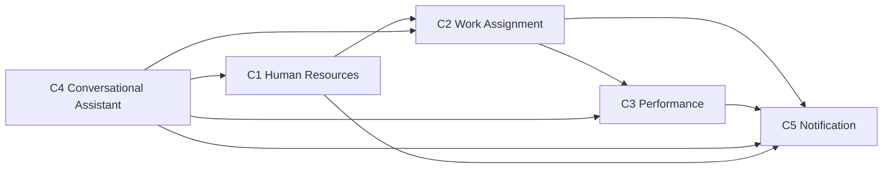
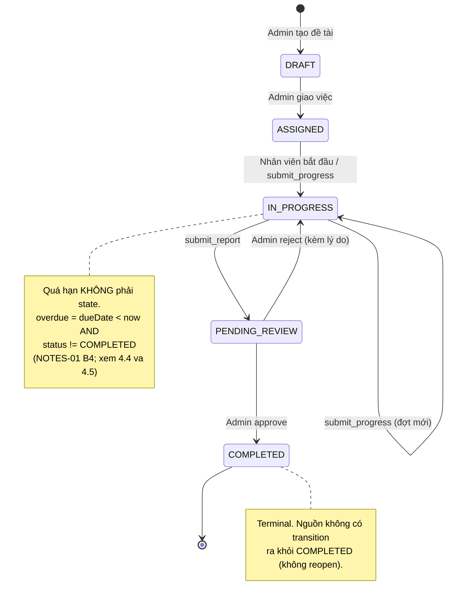

# 04 — Mô hình miền (Domain Model)

Khóa luận KLCN133 — *Xây dựng Chatbot chuyển đổi số quản lý nhân sự*.
File này định nghĩa **ngôn ngữ thống nhất**, **ranh giới miền nghiệp vụ**, **machine trạng thái vòng đời
đề tài** và **quy tắc nghiệp vụ**. File kế tiếp (`05-data-model.md`) dịch các khái niệm ở đây sang
collection Mongo; file `07-auth-rbac.md` dịch quy tắc quyền ở mục 5 sang matrix.

## 0. Nguồn và ký hiệu

| Ký hiệu | Nghĩa |
|---|---|
| `(NOTES-01 B<n>)` | Quyết định lấy từ batch B<n> của `docs/research/NOTES-01.md` |
| `(RP §<n>)` | Ràng buộc / mục của `docs/research/RESEARCH-PLAN.md` |
| `// SUY DIỄN — cần xác nhận` | Khái niệm nguồn nghiên cứu **không nêu**, người viết thêm để mô hình chạy được |
| `[CẦN NGUỒN]` | Cần URL / văn bản GVHD trước khi số này được chép vào báo cáo |
| `TBD` | Nguồn nghiên cứu không đưa con số → để trống, **không đoán** |

Ràng buộc cứng của đề cương áp dụng cho cả file: 7 chức năng F1–F7, 5 cấp bậc nhân sự, trạng thái đề tài
tiếng Việt "Khởi tạo, Đã giao, Đang thực hiện, Chờ duyệt, Hoàn thành", RBAC Admin/Employee (RP §1).

---

## 1. Bounded context

Năm miền, cắt theo **trách nhiệm nghiệp vụ** chứ không theo thư mục code. Một miền có thể gọi sang miền
khác qua service/tool, nhưng **không** viết trực tiếp vào collection của miền khác.

| # | Bounded context | Vai trò nghiệp vụ | Chức năng đề cương | Collection chính (`NOTES-01 B4`) | Role hệ thống tham gia |
|---|---|---|---|---|---|
| C1 | **Human Resources** | Quản lý danh tính đăng nhập, hồ sơ nhân viên, phòng ban, 5 cấp bậc, kho kỹ năng | F1 | `users`, `employees`, `departments` | Admin (sửa), Employee (đọc hồ sơ của mình) |
| C2 | **Work Assignment** | Vòng đời đề tài công việc: tạo → giao → thực hiện → nộp → duyệt; phân công theo kỹ năng; báo cáo nghiệm thu | F2, F4, F7 | `projects`, `project_events`, `reports`, `feedback_events` | Admin (giao/duyệt), Employee (thực hiện/nộp) |
| C3 | **Performance** | Chu kỳ đánh giá KPI, điểm máy cho, điểm chốt, hiệu chỉnh (calibration), công bố, lịch sử | F5, F6 | `evaluations` | Admin (chấm/duyệt/override), Employee (tự nhận xét) |
| C4 | **Conversational Assistant** | Intent → tool, Agent Loop, RAG chính sách, giải thích gợi ý, abstention | F3 (+ F4/F5 ở tầng hiển thị) | `policies` ; đọc/ghi qua tool của C1–C3 | cả hai |
| C5 | **Notification** | Thông báo bền (durable), nhắc hạn, digest, chống spam | F7, S6 | `notifications` (+ job scheduler `Agenda`) | hệ thống gửi; cả hai nhận |

Sơ đồ phụ thuộc (mũi tên = "gọi sang / phát sự kiện cho"):



Nguyên tắc ranh giới (có bằng chứng từ nguồn):

- **C1 tách `users` khỏi `employees`** vì quyền hệ thống (`role`) và dữ liệu nghiệp vụ (`level`) là hai trục
  khác nhau, "RBAC không trộn 2 trục" `(NOTES-01 B3)`. Chi tiết ở mục 3 và mục 5.
- **C2 owns `project_events`**: vòng đời đề tài cần "theo dõi tiến độ" + lịch sử chuyển tiếp
  `(RP §3 B4: "Audit/soft-delete/history (event log) — phục vụ theo dõi tiến độ")`.
- **C4 không sở hữu dữ liệu nghiệp vụ nào ngoài `policies`.** Tool catalog của nó chỉ *đọc/ghi hộ* người dùng
  vào collection của C1–C3 `(NOTES-01 B6)`; mỗi lần tool ghi chạy, C4 phải đi qua cùng lớp service và cùng
  RBAC check như REST (BR-05, BR-06).
- **C5 không được suy trạng thái đề tài từ `notifications`.** Chiều duy nhất là C2/C3 → C5;
  "durable notification vẫn phải persist phía app" `(NOTES-01 B7)` nhưng document thông báo chỉ là *bản sao
  để hiển thị*, không phải nguồn chân lý.
- **Không có context "Payroll"**: `RP §3 B0` có nhắc phiếu lương/bảo hiểm trong UF-01, nhưng `NOTES-01 B0`
  chỉ chốt flow hồ sơ cá nhân — lương không nằm trong 7 chức năng và không có collection nào trong
  `NOTES-01 B4` chứa dữ liệu lương. Đưa vào danh sách ngoài phạm vi (mục 8).

---

## 2. Ngôn ngữ thống nhất (ubiquitous language)

Cột "Tên kỹ thuật" là tên sẽ xuất hiện trong code/API/schema; cột "Nghĩa nghiệp vụ" là cách nói với người
dùng Việt Nam. Một thuật ngữ chỉ có **một** cách viết trong code.

| Thuật ngữ nghiệp vụ (vi) | Tên kỹ thuật | Miền | Nghĩa / ràng buộc | Nguồn |
|---|---|---|---|---|
| đề tài công việc | `project` | C2 | Một đầu việc được giao, có hạn, có người chịu trách nhiệm. Không phải "đề tài NCKH" | `B4`, RP §1 |
| mã nhân viên | `employeeCode` | C1 | Định danh nghiệp vụ, **UNIQUE** | `B4` index |
| nhân viên | `employee` | C1 | Hồ sơ HR: cấp bậc, phòng ban, kỹ năng | `B4` |
| hồ sơ / tài khoản | `user` | C1 | Danh tính đăng nhập + `role` hệ thống | `B4`, `B3` |
| phòng ban | `department` | C1 | Nhóm nhân sự; là trục scope dữ liệu (`departmentId`) | `B4`, `B7` room |
| cấp bậc | `level` | C1 | 5 bậc: Intern, Junior, Middle, Senior, Lead — **dữ liệu, không phải quyền** | `B3` |
| vai hệ thống | `role` | C1 | `Admin` \| `Employee` — **quyền, không phải cấp bậc** | `B3` |
| kỹ năng | `skills` | C1 | Mảng kỹ năng của nhân viên, đầu vào của matching | `B4`, `B5` |
| yêu cầu kỹ năng của đề tài | `requiredSkills` | C2 | Đầu vào phía đề tài của bài toán "skills ↔ yêu cầu đề tài" | `RP §3 B5` // **SUY DIỄN — cần xác nhận** (tên field) |
| trạng thái đề tài | `status` | C2 | Enum 5 giá trị lifecycle, xem mục 4 | `B4` |
| quá hạn | *dẫn xuất* `overdue` | C2 | `dueDate < now AND status != COMPLETED` — **không phải state**; xem 4.4 | `B4` |
| phiên bản lock | `version` | C2 | Số nguyên tăng mỗi lần ghi, phục vụ atomic conditional update | `B1` |
| lịch sử trạng thái | `statusHistory[]` | C2 | Mảng append-only bên trong `projects` | `B1` |
| sự kiện vòng đời | `project_event` (collection `project_events`) | C2 | Bản ghi audit bất biến của một hành động lên đề tài | `B4` |
| báo cáo nghiệm thu | `report` | C2 | Bài nộp của nhân viên cho một đề tài, duyệt được approve/reject | `B4`, RP §1 (F7) |
| cập nhật tiến độ | `submit_progress` | C2 | Tool ghi có xác nhận; tạo `project_event`, không đổi trạng thái duyệt | `B6` tool catalog, `B0` UF-05 |
| gợi ý phân công | `find_candidates` | C2/C4 | Tool đọc: trả danh sách ứng viên xếp hạng | `B6` |
| giải thích gợi ý | `explain_candidate_match` | C2/C4 | Tool đọc: breakdown đóng góp từng kỹ năng | `B6`, `B14` |
| phản hồi gợi ý | `feedback_event` (collection `feedback_events`) | C2 | Admin bấm Đồng ý / Từ chối một gợi ý → lưu để hiệu chỉnh về sau (S4) | `B4`, `RP §9 S4` |
| kỳ đánh giá | `period` | C3 | Khóa kỳ KPI; `(employeeId, period)` **UNIQUE** | `B4` index |
| tự nhận xét | `selfReview` | C3 | Bước 1 chu kỳ KPI do nhân viên viết | `B0` (!) quyết định |
| nhận xét của quản lý | `managerReview` | C3 | Bước 2; văn bản đưa vào phân tích ngữ nghĩa | `B0`, `B6` |
| điểm máy cho | `machineScore` | C3 | Kết quả công thức tất định, **không đổi** sau khi sinh | `B6` |
| điểm chốt | `finalScore` | C3 | Điểm được công bố; bằng `machineScore` trừ khi có override | `B6` |
| lý do điều chỉnh | `overrideReason` | C3 | Bắt buộc khi `finalScore ≠ machineScore` | `B6`, `RP §9 S13` |
| người điều chỉnh / lúc điều chỉnh | `changedBy` / `changedAt` | C3 | Truy vết override | `B6` |
| tín hiệu AI | `sentiment` \| `themes` \| `riskSignals` \| `suggestedScoreComponent` \| `explanation` | C3 | Phần **duy nhất** AI được tạo; không sinh KPI cuối | `B6` |
| hiệu chỉnh | `calibration` | C3 | Bước 3 chu kỳ KPI (đối chiếu giữa phòng ban) — **khác** nghĩa "calibration điểm cosine" ở C4 | `B0` |
| hiệu chuẩn điểm tương đồng | *calibration (model)* | C4 | `raw cosine → Platt/Logistic → estimated probability → threshold` | `B13` |
| công bố KPI | `publish` | C3 | Bước 4; `finalScore` thành số chính thức, vào `history` | `B0` |
| lịch sử KPI | `history` | C3 | Tập evaluation đã publish theo kỳ | `B0` |
| từ chối có lý do | `abstain` | C4 | Confidence thấp → hỏi lại, không đoán | `B13`, `RP §9 S2` |
| chính sách | `policy` | C4 | Tài liệu quy định, có version, trả lời phải kèm nguồn | `B6`, `B0` UF-10 |
| mẩu chính sách | `chunk` | C4 | Đơn vị retrieval + embedding cho Vector Search | `B6` |
| thông báo | `notification` | C5 | Bản ghi bền, có `readAt` | `B4`, `B7` |
| nhắc hạn | `reminder` | C5 | Job scheduler sinh notification theo deadline | `B0` UF-09, `B15` |
| bản tóm trong ngày | `digest` | C5 | 1 bản/ngày cho Admin; kênh digest | `B0` matrix, `RP §9 S6` |
| phiên refresh token | `refresh_session` (collection `refresh_sessions`) | C1 | Một vòng đời RT, thuộc một `familyId` | `B3` |
| gia đình token | `familyId` | C1 | Chuỗi RT cùng gốc; reuse → revoke **cả family** | `B3` |
| xác nhận trước khi ghi | `confirm-before-write` | C4 | Tool ghi phải qua bước confirm | `B6`, `RP §9 S8` |
| phạm vi do server gắn | *server scope injection* | C4 | Model chỉ chọn template; server tự điền user/department | `B15` |
| tin nhắn chống trùng | `clientMessageId` | C4 | Mỗi client message mang id để idempotent khi reconnect | `B7` |

> Lưu ý dịch thuật: hai chỗ "calibration" trong bảng trên **cố ý tách**. Trong `08-algorithms.md` nên dùng
> `confidenceCalibration` cho nghĩa C4 và `performanceCalibration` cho nghĩa C3 để không trùng từ
> // **SUY DIỄN — cần xác nhận**.

---

## 3. Năm cấp bậc nhân sự

`NOTES-01 B3` chốt enum `level` và ràng buộc "level là dữ liệu nghiệp vụ, không phải quyền":

```text
level = Intern | Junior | Middle | Senior | Lead
```

| # | `level` | Gọi trong UI tiếng Việt | Được suy ra điều gì từ nguồn | Chưa được suy ra |
|---|---|---|---|---|
| 1 | `Intern` | Thực tập sinh | Là 1 trong 5 bậc của F1 | Quyền, thang lương, phạm vi dữ liệu — nguồn không nêu |
| 2 | `Junior` | Nhân viên | như trên | như trên |
| 3 | `Middle` | Nhân viên chính thức / có kinh nghiệm | như trên | như trên |
| 4 | `Senior` | Nhân viên senior | như trên | như trên |
| 5 | `Lead` | Phụ trách nhóm | `B0` matrix có đối tượng "Admin" nhận notification KPI/digest; `Lead` có phải là Admin không → **không có trong nguồn** | như trên |

Ba quyết định mô hình hoá, ghi rõ mức an toàn:

1. **`level` không nhân bản thành role.** Không có "Lead được approve" trong nguồn nào của `NOTES-01`, nên
   mô hình này **không** cho `level` mở khoá permission. Quyền chỉ đến từ `role` `(B3)`.
2. **`level` không phải đầu vào của KPI.** Công thức KPI ở `B6` gồm *objective completion + semantic signal
   + manager assessment*; không có số hạng theo cấp bậc. Nếu nghiệp vụ muốn "Lead nặng hơn Junior" thì đó là
   thay đổi phạm vi, phải qua GVHD (`RP §12` luật 4).
3. **`level` có phải là document riêng không?** Không. `NOTES-01 B4` liệt kê 11 collection và enum 5 giá trị
   là đóng, nên `level` là **field enum trên `employees`**, không phải collection `levels`
   // **SUY DIỄN — cần xác nhận** (cách lưu), nhưng là cách duy nhất khớp với danh sách 11 collection.

Định nghĩa nghiệp vụ của từng bậc (tiêu chí lên bậc, số năm, trách nhiệm) là **dữ liệu tham khảo nội bộ công
ty giả lập** — `[CẦN NGUỒN]`, và đang nằm trong câu hỏi §7.10 của `RP` (dữ liệu thật hay giả lập). Tài liệu
này không tự đặt ra tiêu chí.

---

## 4. Machine trạng thái vòng đời đề tài (F2)

### 4.1 Ánh xạ tên tiếng Việt ↔ enum

Đề cương cho 5 trạng thái tiếng Việt (`RP §1`, `RP §3 B4`); `NOTES-01 B4` cho enum kỹ thuật. Ánh xạ một lần,
dùng thống nhất ở mọi file:

| Tiếng Việt (đề cương) | Enum (code) | Trạng thái | Ai giữ |
|---|---|---|---|
| Khởi tạo | `DRAFT` | đang mở | mở |
| Đã giao | `ASSIGNED` | đang mở | mở |
| Đang thực hiện | `IN_PROGRESS` | đang mở | mở |
| Chờ duyệt | `PENDING_REVIEW` | đang mở | mở |
| Hoàn thành | `COMPLETED` | **chốt (terminal)** | chốt |
| — | ~~`CANCELLED`~~ | **KHÔNG có state này** — chốt ở 4.5 | — |

### 4.2 Sơ đồ



### 4.3 Bảng transition

`T-05` là nhánh reject; `reject` **không** quay về `ASSIGNED` mà về `IN_PROGRESS`, đúng sơ đồ
`NOTES-01 B4`. "Hiệu ứng phụ" gồm 3 loại: **WS** (tên event ở `B7`), **audit** (`project_events`,
append-only), **notify** (`B0` notification matrix).

| ID | From | To | Actor (role) | Điều kiện trước (precondition) | Hiệu ứng phụ: WS · audit · notify | Hành vi khi từ chối |
|---|---|---|---|---|---|---|
| T-01 | — | `DRAFT` | Admin | title + `dueDate` + `departmentId` hợp lệ | `project:updated` · event `CREATED` · *(không gửi notification — `B0` không có dòng này)* | — |
| T-02 | `DRAFT` | `ASSIGNED` | Admin | `assigneeIds` không rỗng; công cụ `assign_project` **confirm + Admin** `(B6)` | `project:updated` · event `ASSIGNED` · notify **Assignment mới** → Employee, WS theo event `(B0)` | Nhân viên từ chối việc được giao: **được** — nhưng bằng **response ghi trên event**, không bằng state mới → xem 4.6, BR-21 (Q-02 đã đóng) |
| T-03 | `ASSIGNED` | `IN_PROGRESS` | Employee (hoặc Admin qua `change_project_status`) | Người đổi phải thuộc `assigneeIds` `// SUY DIỄN — cần xác nhận` | `project:updated` · event `STARTED` · không notify | — |
| T-04 | `IN_PROGRESS` | `PENDING_REVIEW` | Employee | `submit_report` **confirm** `(B6)`; report được ghi `(B4: reports)` | `report:updated` + `project:updated` · event `REPORT_SUBMITTED` · notify **Báo cáo đã nộp** → Admin, WS theo event `(B0)` | — |
| T-05a | `PENDING_REVIEW` | `COMPLETED` | Admin | Có báo cáo nộp gần nhất; `reason` nên có để truy vết `// SUY DIỄN` | `project:updated` + `kpi:updated` · event `APPROVED` · notify: **không có dòng approve trong `B0`** → xem Q-04 | — |
| T-05b | `PENDING_REVIEW` | `IN_PROGRESS` | Admin (reject) | `reason` **bắt buộc** `// SUY DIỄN` (suy từ intent "xem lý do bị từ chối" ở `B0`) | `project:updated` + `report:updated` · event `REJECTED` (giữ bản report bị từ chối) · notify **Báo cáo bị reject** → Employee, WS theo event `(B0)` | Reject = quay lại `IN_PROGRESS`, **không** xoá lịch sử, **không** trừ điểm tự động; nhân viên nộp lại bằng T-04 (vòng *resubmit* của `B0`: "reject/request-change → resubmit") |
| T-06 | `IN_PROGRESS` | `IN_PROGRESS` | Employee | `submit_progress` **confirm** `(B6)`; `clientMessageId` chống trùng `(B7)` | `project:updated` · event `PROGRESS_UPDATED` · notify: chỉ khi chạm ngưỡng nhắc trong matrix `(B0)` | — |
| — | ~~T-07~~ | — | — | **ĐÃ loại** — `CANCELLED` không phải state; xem 4.5 | — | — |

Ràng buộc chung cho mọi transition (đều có nguồn):

- **Chỉ một transition duy nhất được áp dụng cho một trạng thái hiện tại.** `PENDING_REVIEW` có đúng 2 cửa
  ra (approve / reject) theo sơ đồ `B4`.
- **Không nhảy tắt.** Không có `DRAFT → PENDING_REVIEW`, không `COMPLETED → *`. Vượt `ASSIGNED` mà chưa có
  `IN_PROGRESS` phải qua T-03 rồi T-04 — cách diễn giải này **chưa có trong nguồn**, `// SUY DIỄN`.
- **Mọi transition ghi `version` và `statusHistory[]` bằng một `findOneAndUpdate` có điều kiện** `(B1)`;
  pseudocode nằm trong `05-data-model.md` §"Tại sao không transaction".
- **Mọi transition là một mutation → audit bắt buộc** `(B6: "audit every mutation")`.
- **Coverage CI**: 100% transition của state machine phải có test `(RP §11)`.

### 4.4 "Quá hạn" là dẫn xuất, không phải trạng thái

`NOTES-01 B4` bác giả định dùng `OVERDUE` làm state, lý do nguyên văn: *trộn lifecycle state với deadline
condition*. Mô hình tuân thủ:

```text
overdue(project) = project.dueDate < now
                   AND project.status != COMPLETED
```

Hệ quả nghiệp vụ:

- Không có notification "chuyển sang OVERDUE"; thay vào đó job nhắc hạn sinh notification theo **điều kiện**
  (deadline còn 3 ngày: 1 lần/ngày; còn 1 ngày: 1 lần; quá hạn: Employee + Admin, WS + digest, 1 lần/ngày)
  `(B0 matrix)`.
- Dashboard hiển thị overdue như một **lọc/badge**, không phải tab trạng thái. Danh sách "đề tài sắp hết hạn"
  và "việc nào sắp quá hạn" đều là tool đọc `(B0 intent catalog)`.
- Một đề tài overdue vẫn có thể đang `IN_PROGRESS` và vẫn được approve bình thường; quá hạn **không** chặn
  T-05a trong nguồn này `// SUY DIỄN — cần xác nhận`.

### 4.5 Ba khoảng trống phải chốt trước khi code F2

1. ~~`CANCELLED`~~ — **đã chốt: không có state này.** Sơ đồ `B4` chỉ có 5 state và không có transition nào
   tới `CANCELLED`; nó chỉ xuất hiện ở vế phủ định của công thức overdue. Giữ 5 state và bỏ `CANCELLED`
   khỏi công thức (Q-01 đã đóng). Hệ quả: **hệ thống hiện không có nghiệp vụ "hủy đề tài"** — đã chuyển
   thành mục park ở `backlog-parked.md`, cần GVHD duyệt nếu muốn có.
2. `DRAFT → ASSIGNED` khi Admin đổi ý: nguồn không có transition lùi. Cách ít xâm phạm nhất là cho phép sửa
   `assigneeIds` ngay tại `DRAFT` (tạo `project_event`, không đổi state) `// SUY DIỄN`. Phản hồi của nhân viên
   (chấp nhận / từ chối / xin đổi) **không** nằm ở khoảng trống này nữa — đã chốt ở 4.6.
3. Reopen sau `COMPLETED` (Q-05): không có trong sơ đồ → mặc định **không hỗ trợ** ở MVP.

### 4.6 Xác nhận phân công (assignment acknowledgement) — dữ kiện, không phải state

**Đã chốt** từ `19-vertical-workforce-assessment.md` §2.1 và §3 (mục **VC-01** = **LÀM**). Đóng câu hỏi Q-02.

**Vấn đề.** Sơ đồ 4.2 chỉ đường một chiều từ `ASSIGNED` trở đi: nhân viên nhận việc rồi *cứ thế làm*. Không có
bước nào để nói "tôi nhận" hay "tôi không nhận được". Kết quả là khi đề tài trễ, không ai nhận phần trễ đó là
của mình — đúng chỗ mà F7 (nghiệm thu) và nhắc hạn đang yếu nhất.

**Quy tắc đã chọn.** Sau T-02 (`DRAFT → ASSIGNED`), người được giao có **ba** phản hồi:

```text
ACKNOWLEDGED            "tôi nhận đề tài này"
DECLINED            "tôi không nhận được, lý do …"
CHANGE_REQUESTED    "tôi muốn xin đổi thời gian / đổi yêu cầu"
```

- Mỗi phản hồi là **một bản ghi `project_events`** (append-only, cùng khung BR-03) với `actor` là người được
  giao, `time`, `source` (`[CHAT]` tool / `[UI]` dashboard) và **`reason` optional** — riêng `DECLINED` nên
  có lý do để Admin quyết bước tiếp `// SUY DIỄN — cần xác nhận` (nguồn không bắt buộc field này).
- **State machine 4.2 giữ nguyên, không thêm transition nào.** `projects.status` vẫn đúng 5 giá trị
  `DRAFT | ASSIGNED | IN_PROGRESS | PENDING_REVIEW | COMPLETED`. Đây là lựa chọn có tính toán, không phải
  thiếu dữ liệu: xem BR-21 và mục 10 điểm 6.
- Loại event mới (`ACKNOWLEDGED` / `DECLINED` / `CHANGE_REQUESTED`) được thêm vào enum `project_events.type`
  — chi tiết field nằm ở `05-data-model.md` §3.5; **không** thêm collection mới.

**Quy tắc trách nhiệm (nghiệp vụ, không phải chi tiết UI).** *Người được giao vẫn chịu trách nhiệm về đề tài
cho tới khi Admin xử lý phản hồi* — reassign (`assign_project`, quyền Admin) hoặc xác nhận lại. Đây là phát
hiện nghiệp vụ đáng học nhất từ nguồn 7shifts, được trích trong `19-…` §2.1:

> "The original shift remains the responsibility of the employee until the shift trade request is approved by
> management."

Nó là quy tắc nghiệp vụ vì nó trả lời ba câu hỏi mà hệ thống phải xử lý bằng dữ liệu, không bằng giao diện:
(a) **ai là người được nhắc hạn** khi đề tài sát `dueDate` — vẫn là người trong `assigneeIds`, kể cả khi họ đã
`DECLINED` mà chưa được xử lý; (b) **truy vết trách nhiệm khi trễ** — timeline `project_events` cho thấy phản
hồi đã gửi lúc nào và Admin đã đóng nó chưa, thay vì tranh luận "em có nói là em không làm được"; (c) **phản
hồi không phải một lệnh** — `DECLINED` không tự gỡ tên ai khỏi đề tài, nên nó không cần (và không được) nhân
một trạng thái lifecycle. Trạng thái là thứ hệ thống suy ra để *đọc*; quyền chuyển giao công việc nằm ở Admin.

Các quyền "không tự đổi quyền cho mình" đi kèm (Admin xử lý phản hồi, không phải Employee) thuộc
`07-auth-rbac.md`; ở tầng miền, nó là hệ quả của BR-22.

**Nhánh "không phản hồi."** Im lặng **không** được mặc định hiểu là đồng ý `// SUY DIỄN — docs đặt ra, nguồn
NOTES-02 chỉ khuyến cáo "không tự coi im lặng là accept"`. Hành vi:

1. Sau mốc nhắc (ngưỡng ngày: `TBD` — `[CẦN NGUỒN]`, không đoán), hệ thống gửi nhắc cho Employee theo đúng
   nhịp chống trùng của BR-12 (dedupe key để job chạy lại không gửi đúp).
2. Quá ngưỡng `TBD` mà vẫn chưa có phản hồi → **báo Admin** (đây là điểm khác biệt với cách "auto-accept"
   thường gặp ở thiết kế vội); không có trạng thái `NO_RESPONSE`, chỉ có event nhắc và event leo thang
   `// SUY DIỄN` (tên hai loại event do docs đặt).
3. Không gửi daily digest cho Employee nếu đã có nhắc actionable — theo `NOTES-02` §VC-01/Notification.

**Không nằm trong phạm vi mục này:** đổi ca giữa hai nhân viên (`VF-01`), xin nghỉ/availability (`VC-02`) —
cả hai ở `backlog-parked.md`, chờ GVHD (`19-…` §3).

---

## 5. Quy tắc nghiệp vụ (BR-01 …)

Cột "Điểm thi hành" chỉ nơi **duy nhất** được phép enforcing, để tránh logic rải rác.

| ID | Quy tắc | Nguồn | Điểm thi hành |
|---|---|---|---|
| **BR-01** | "Quá hạn" không bao giờ là trạng thái. Chỉ là vị từ dẫn xuất theo công thức 4.4. Cấm ghi `status = OVERDUE`. | `B4` (!) | `domain/project/status.ts` (hàm dẫn xuất) + DB enum |
| **BR-02** | Một mutation trạng thái = một **atomic conditional update** theo `(_id, status: expected, version: v)`; không dựa vào transaction đa collection. Xung đột → reload + trả 409, **không** auto-merge. | `B1`, `B4` | `projectRepository` |
| **BR-03** | `statusHistory[]` và `project_events` là **append-only**. Không sửa, không xoá bản ghi đã ghi. | `B1`, `B4`, `RP §3 B4` | repository (chỉ `$push`/`insertOne`) |
| **BR-04** | Reject không xoá dữ liệu: report bị từ chối vẫn còn, vòng *resubmit* tạo report mới; lịch sử giữ nguyên `(B0 UF-07: "reject giữ lịch sử")`. | `B0`, `B4` | `reportService` |
| **BR-05** | **Confirm-before-write.** Tool đọc chạy ngay; tool ghi (`submit_progress`, `submit_report`, `assign_project`, `change_project_status`, `override_kpi`) phải có bước xác nhận. | `B6`, `B0` S8, `RP §9 S8` | agent loop (nhánh write) |
| **BR-06** | **RBAC check ở MỖI tool call**, không chỉ ở router; `role` quyết định quyền, `level` không bao giờ mở quyền. Không dùng CASL ở MVP (2 role). | `B3`, `B6` | tool middleware `(B6: "Permission check")` |
| **BR-07** | LLM **không sinh KPI cuối**. AI chỉ tạo `sentiment`, `themes`, `riskSignals`, `suggestedScoreComponent`, `explanation`. KPI cuối do **công thức tất định**. | `B6` (!) | `kpiService` |
| **BR-08** | **Trần sentiment (counter-weight + ceiling):** thành phần điểm lấy từ nhận xét bị chặn trên bởi tỷ lệ hoàn thành thật của đề tài. Nhận xét tích cực không thể đưa `machineScore` vượt mức công việc đã làm. Ngưỡng cụ thể: `TBD` (chưa có trong nguồn). | `RP §9 S13` | `kpiService` (hàm ceiling) |
| **BR-09** | **Override phải có lý do và log bất biến.** Khi `finalScore ≠ machineScore` thì `overrideReason` và `changedBy` + `changedAt` bắt buộc có mặt; bản ghi override không được sửa. | `B6`, `RP §9 S13` | `kpiService` + `evaluations` |
| **BR-10** | Điểm cosine thô **không** được diễn giải thành xác suất đúng (`0.82 ≠ 82%`). Chỉ `calibrated probability` sau hiệu chuẩn mới được dùng để cắt ngưỡng; dưới ngưỡng → `abstain`/hỏi lại. | `B13`, `RP §9 S2` | `ai-service` + card UI |
| **BR-11** | Giải thích gợi ý bằng **skill-to-skill cosine + leave-one-skill-out**; **cấm** giải thích bằng "attention của PhoBERT cao". Mỗi gợi ý kèm breakdown đóng góp + workload penalty. | `B14` (!) | `explain_candidate_match` |
| **BR-12** | Anti-spam notification đúng matrix: deadline 3 ngày = 1 lần/ngày; 1 ngày = 1 lần; quá hạn = 1 lần/ngày; sự kiện report/assignment = theo event; digest = 1 bản/ngày. Mỗi notification có khoá trùng lặp để job chạy lại không gửi đúp. | `B0 matrix`, `B15` (idempotent job), `B7` | `notificationService` |
| **BR-13** | Mọi client message có `clientMessageId`; message trùng id bị bỏ qua (idempotent khi reconnect/retry). | `B7` | socket handler |
| **BR-14** | NL→dữ liệu (S10) bị khoá: model chỉ được trả tên template + tham số nằm trong Zod enum; **cấm** trả `$lookup`, `$where`, `$function`, tên collection, raw pipeline. Server inject scope user/department, áp row cap + timeout. | `B15`, `RP §9 S10` | `reportQueryService` |
| **BR-15** | Trả lời chính sách phải kèm **document / version / source**. Không đủ bằng chứng retrieval → từ chối đoán `(B0 UF-10: "không đủ bằng chứng → từ chối đoán")`. | `B6`, `B0` | `search_policy` |
| **BR-16** | Employee đọc dữ liệu của **chính mình**; dữ liệu toàn phòng ban (`get_department_kpi`, `get_employee` người khác) chỉ Admin. Suy ra từ cách đặt tên tool và phân quyền Admin-only ở `B6` — phân vùng cụ thể là `// SUY DIỄN — cần xác nhận`. | `B6` | tool middleware + BR-14 |
| **BR-17** | `evaluation` là duy nhất cho một `(employeeId, period)`; một kỳ không có hai bản đánh giá. | `B4` index UNIQUE | `evaluations` |
| **BR-18** | Một đề tài có nhiều người làm (`assigneeIds` là mảng). Việc quy đổi công sức từng người vào KPI của ai đó là **chưa có trong nguồn** — MVP tính theo đề tài, không chia tỷ lệ đóng góp. | `B4` index `(assigneeIds, status)` | `kpiService` |
| **BR-19** | Guard của Agent Loop: `maxSteps = 5`, tool timeout, LLM timeout, trần kích thước kết quả tool; Zod validate mọi tham số trước khi thực thi. | `B6` | agent runtime |
| **BR-20** | Tính năng ngoài phạm vi **không** được xuất hiện trong state machine/collection. UF-02 (nghỉ phép), UF-03 (onboarding), UF-07 (OKR), UF-08 (pulse survey) nằm ở `docs/backlog-parked.md` tới khi GVHD duyệt. | `B0` | review tài liệu |
| **BR-21** | **Phản hồi phân công là dữ kiện append-only, không phải state.** `ACKNOWLEDGED` / `DECLINED` / `CHANGE_REQUESTED` (4.6) chỉ là một bản ghi `project_events` có `actor` + `time` + `source` (+ `reason` optional). **Cấm** mở rộng enum `projects.status` quá 5 giá trị `DRAFT`/`ASSIGNED`/`IN_PROGRESS`/`PENDING_REVIEW`/`COMPLETED`; `DECLINED` không tự đổi `assigneeIds`, không tự đổi `status`. Người được giao vẫn chịu trách nhiệm tới khi Admin xử lý phản hồi. | `NOTES-02` §VC-01 ("Entity cần lưu", "State transition — PROPOSED") + `19-…` §2.1, §3; quy tắc trách nhiệm lấy từ 7shifts, dẫn qua `19-…` §2.1. **`// SUY DIỄN`**: vế "cấm mở rộng enum" và cách đóng nhánh phản hồi là docs đặt ra, nguồn chỉ PROPOSED state riêng | `projectEventService` (chỉ `insertOne`) + DB enum `projects.status` + test `11 §3` |
| **BR-22** | **Admin chỉ thao tác/duyệt trong phạm vi `departmentId` được gán**, và **không tự duyệt** yêu cầu do chính mình tạo (self-approval bị chặn). **Không** thêm role thứ ba: đây là *ràng buộc scope* đặt trên `role = Admin`, không phải quyền mới — `role` vẫn đúng hai giá trị theo ADR-009. | `NOTES-02` §A4 (phương án fallback `scope.departmentIds`) + §VC-01/Audit ("Manager không tự approve request của chính mình nếu cùng actor"); 7shifts *"…and is assigned to the same Department as the Employee"* qua `19-…` §2.3a. **`// SUY DIỄN`**: ràng buộc theo `departmentId` áp cho **mọi** thao tác/duyệt là docs đặt ra — nguồn chỉ nói nó cho bài toán availability; chi tiết permission thuộc `07-auth-rbac.md`, threat thuộc `13-security.md` | tool middleware scope-check (nhánh `write`) + service tầng duyệt |

---

## 6. Luồng nghiệp vụ KPI (F5) — có điều chỉnh so với đề cương

### 6.1 Điều chỉnh, ghi rõ để hội đồng không đọc nhầm

Đề cương mô tả F5 là *"phân tích ngữ nghĩa nhận xét để lượng hóa KPI"* `(RP §1)`, tức một bước
"AI đọc nhận xét → KPI". `NOTES-01 B0` **bác** cách thu gọn đó (`(!) QUYẾT ĐỊNH`) và chốt chu trình:

```text
self-review → manager review → calibration/approval → publish → history
```

bằng chứng ngành: MISA có self-evaluation, Personio có `request → approval → reject/request-change →
resubmit → notification` `(B0)`. **Đây là mở rộng phạm vi so với đề cương**, do đó phải xin GVHD duyệt bằng
văn bản trước khi ghi vào `00-vision-scope.md` `(RP §12 luật 4)`. Tài liệu này vẫn mô tả đầy đủ vì F5 bắt
buộc phải có chỗ để "hiệu chỉnh" và "công bố"; nếu GVHD cắt, các bước 3–4 rời sang backlog parked.

### 6.2 Bảng bước

| Bước | Actor | Tool/API | Đọc | Ghi | Ràng buộc |
|---|---|---|---|---|---|
| 0. Mở kỳ | Admin | *(scheduler hoặc thao tác Admin)* `// SUY DIỄN` | `projects` trong kỳ | tạo `evaluations` trống cho từng `(employeeId, period)` | BR-17 (unique theo kỳ) |
| 1. Tự nhận xét | Employee | tool "gửi nhận xét" `(B0 intent)` ; REST `// SUY DIỄN` | `projects` của mình | `evaluations.selfReview` | Nhân viên chỉ thấy KPI của mình (`get_my_kpi`) |
| 2. Quản lý đánh giá | Admin | REST; chưa có tool ghi `managerReview` trong catalog `B6` → xem Q-06 | `selfReview`, `projects`, `reports` | `evaluations.managerReview` | Đây là *manager assessment* — một trong ba đầu vào công thức `(B6)` |
| 3. Phân tích ngữ nghĩa | hệ thống | `ai-service` | `selfReview` + `managerReview` + tỷ lệ hoàn thành | `sentiment`, `themes`, `riskSignals`, `suggestedScoreComponent`, `explanation` | BR-07: AI **không** viết `machineScore`/`finalScore` |
| 4. Tính điểm máy | hệ thống | `kpiService` | ba thành phần ở `(B6)` | `machineScore` (bất biến) | BR-08 (trần theo completion thật) |
| 5. Hiệu chỉnh / duyệt | Admin | `override_kpi` (confirm + reason + Admin) `(B6)` | `machineScore`, breakdown | `finalScore`, `overrideReason`, `changedBy`, `changedAt` | BR-05, BR-06, BR-09 |
| 6. Công bố | Admin | REST `// SUY DIỄN` | bản đã duyệt | trạng thái publish `// SUY DIỄN — cần xác nhận` (tên field) + WS `kpi:updated` `(B7)` | Notification "KPI cần review" → Admin, digest 1 lần/ngày **trước** bước công bố `(B0)` |
| 7. Lịch sử | cả hai | `get_my_kpi`, `get_department_kpi`, "so sánh KPI theo tháng" `(B0)` | các kỳ đã publish | — | Read-only; BR-16 |

### 6.3 Công thức KPI tất định

`NOTES-01 B6` cho **đầu vào/đầu ra**, không cho trọng số. Mô hình chỉ cam kết khung sau:

```text
machineScore = F( objectiveCompletionScore,   # tỷ lệ hoàn thành thật, tính từ projects/reports
                 reviewSemanticSignal,        # kết quả phân tích nhận xét (bị BR-08 chặn trần)
                 managerAssessment )          # đánh giá của quản lý
               với F tất định, không gọi LLM, chạy lại cho cùng input ra cùng output

finalScore   = machineScore                          # mặc định
             | override khi Admin nhập lý do         # override_kpi: confirm + reason + Admin
```

- `F` cụ dạng gì (trung bình có trọng số? thang 100? bậc thềm?) — **`TBD`**, ghi ở `08-algorithms.md` sau
  khi có protocol eval; tài liệu này không đặt trọng số giả.
- Tính tất định của `F` là thứ làm S12 (bias probe) và S13 (ceiling + override log) **đo được** `(B6)`: nếu
  `F` do LLM sinh ra thì không có baseline để so.
- Người dùng có thể "yêu cầu điều chỉnh điểm" `(B0 intent)`, nhưng intent đó chỉ mở đường tới **bước 5 do
  Admin thực hiện**; Employee không tự override `finalScore` của mình `(B6: override_kpi = Admin)` — suy ra
  từ cột quyền trong catalog, `// SUY DIỄN` cho chiều "Employee gửi yêu cầu".

---

## 7. Hợp đồng tool đọc/ghi của C4 (chiếu từ `07-auth-rbac.md`)

Nguyên tắc: **intent phải map sang tool, không để tất cả thành câu hỏi tự do** `(B0)`. Danh sách 10 tool đọc
+ 5 tool ghi ở `B6` là khóa; C2/C3 phải tồn tại service để tool gọi vào. Không thêm tool nào ngoài catalog
mà chưa qua GVHD.

```text
B0: "submit_report → confirm → reportService.create()"
B6: write: submit_progress (confirm) · submit_report (confirm)
         assign_project (confirm + Admin) · change_project_status (confirm)
         override_kpi (confirm + reason + Admin)
```

Ba hệ quả miền (không phải chi tiết kỹ thuật):

1. `assign_project` là **hành vi T-02** trong machine trạng thái → một tool ghi = một transition hợp lệ,
   không phải "update tự do".
2. `change_project_status` là tool ghi chung nhưng **vẫn phải đi qua bảng transition 4.3**; nó không được
   quyền đặt `status` tuỳ ý (BR-01, BR-02).
3. `override_kpi` là tool ghi **duy nhất** chạm bước 5 mục 6.2 → quyền Admin + confirm + reason.

---

## 8. Ngoài phạm vi miền (out of scope)

| Mục | Lý do dời | Nguồn |
|---|---|---|
| Nghỉ phép & duyệt theo cấp (UF-02) | Ngoài F1–F7; sẽ kéo theo state machine thứ hai | `RP §3 B0`, `RP §12` |
| Onboarding / offboarding thu hồi quyền (UF-03) | "không đưa vào MVP nếu GVHD chưa duyệt mở scope" | `B0` |
| Goal/OKR cascade (UF-07) | Ngoài F1–F7, dễ overlap F5 | `B0` |
| Pulse survey / mức gắn kết (UF-08) | Ngoài F1–F7 | `B0` |
| Lương, phiếu lương, bảo hiểm | Không có trong 7 chức năng, không có collection nào trong `B4` | `RP §1`, `B4` |
| Multi-step approval & delegation khi người duyệt vắng | Chuẩn ngành có thật (`B0` ghi nhận Personio), nhưng MVP chỉ có 2 role và 1 cấp duyệt | `B0` |
| Fine-tune LLM cho policy QA | Baseline dùng RAG | `B6` |
| Scale Socket.IO bằng Redis adapter | 1 instance; ghi rõ out of scope | `B7`, `B1` |

---

## 9. Câu hỏi mở (phải trả lời trước khi code tương ứng)

| ID | Câu hỏi | Chỗ chặn | Thuộc |
|---|---|---|---|
| ~~Q-01~~ **đã chốt** | `CANCELLED` **không** là state: sơ đồ `B4` có đúng 5 state, không có transition nào tới nó. Hệ quả: MVP **không có nghiệp vụ hủy đề tài** → thành mục park ở `backlog-parked.md`, cần GVHD duyệt nếu muốn mở. | 4.1, 4.4, 4.5 | GVHD (chỉ khi mở lại) |
| ~~Q-02~~ **đã chốt** | Nhân viên **có** được từ chối đề tài được giao — nhưng bằng **response ghi trên `project_events`**, **không** bằng state mới. Ba phản hồi `ACKNOWLEDGED` / `DECLINED` / `CHANGE_REQUESTED` ở 4.6; enum `projects.status` vẫn 5 giá trị (BR-21). Trách nhiệm **không** chuyển bằng tuyên bố mà chỉ khi Admin xử lý phản hồi — theo 7shifts: *"The original shift remains the responsibility of the employee until the shift trade request is approved by management"* (dẫn trong `19-vertical-workforce-assessment.md` §2.1). | 4.6, BR-21, T-02 | đã đóng (`19-…` §3) |
| Q-03 | Từ `ASSIGNED`, nhân viên "bắt đầu" hay Admin mới mở `IN_PROGRESS`? | T-03 | nhóm |
| Q-04 | Có notification cho Employee khi **approve/completed** không? `B0` matrix chỉ liệt kê 9 dòng, không có dòng approve | notify sau T-05a | nhóm |
| Q-05 | Có cho reopen sau `COMPLETED` không? | 4.5 | GVHD |
| Q-06 | `managerReview` được nhập bằng REST hay cần tool chat? Catalog `B6` không có tool này | bước 2 mục 6.2 | nhóm |
| Q-07 | `period` là tháng/quý/theo kỳ HR nào? `B4` chỉ nói `(employeeId, period)` UNIQUE, không định nghĩa granularity của `period` | bước 0 mục 6.2 | nhóm |
| Q-08 | Trọng số của `F` trong 6.3 | S12/S13 có đo được không | `08-algorithms.md` |
| Q-09 | Lead có phải Admin không (mục 3) | BR-16 | GVHD |

---

## 10. Phụ lục — điểm nguồn không nhất quán (phát hiện khi ingest)

Ghi lại để không bị động khi hội đồng hỏi; **không** tự sửa hộ nguồn.

1. ~~`NOTES-01 B4`: `CANCELLED` xuất hiện trong công thức overdue nhưng **không** có trong sơ đồ state machine
   của cùng batch~~ → **đã chốt: loại `CANCELLED`** (xem 4.5). Công thức overdue ở mọi file đã bỏ vế này.
2. `NOTES-01 B4` liệt kê `feedback_events (S4)` với `aiSuggestionId`, nhưng 11 collection **không có** nơi
   chứa bản thân gợi ý để tham chiếu → xử lý ở `05-data-model.md` mục `feedback_events`.
3. ~~`NOTES-01 B0`: dòng 19 và dòng 24 trùng nhau; câu về MISA self-evaluation bị cắt~~ → **đã sửa trong
   `NOTES-01.md`**: dòng trùng bị loại, câu về MISA/Lattice đã viết đủ. Còn treo: **URL nguồn** cho
   Personio / MISA / Oracle HCM / Lattice (mục "CẦN BỔ SUNG" của NOTES-01).
4. `NOTES-01` phần "CẦN BỔ SUNG": danh sách đánh số `1, 2, 4, 4` (thiếu 3, trùng 4) và **URL của mọi con số
   ở B1 bị mất khi paste**. Hệ quả: mọi giới hạn hạ tầng trong các file thiết kế chỉ được nêu như *quyết
   định*, không được nêu như *số liệu đã kiểm chứng* `[CẦN NGUỒN]`.
5. `RP §1` đòi `F1 ≥ 85%`, còn `NOTES-01 B5` bác việc dùng F1 đơn độc cho ranking Top-K và đánh dấu "câu
   phải chốt với GVHD". Không ảnh hưởng trực tiếp 3 file này, nhưng chặn bước 4 mục 6.2 (chất lượng tín
   hiệu ngữ nghĩa đưa vào `machineScore` đo bằng gì).
6. `NOTES-02` §VC-01 đề xuất một state machine riêng cho phân công: `OFFERED → ACCEPTED | DECLINED |
   CHANGE_REQUESTED → OFFERED/REASSIGNED`. Ta **cố ý không** đưa bốn tên này vào `projects.status`, dù chấp
   nhận nội dung nghiệp vụ của flow. Lý do: (a) `OFFERED/ACCEPTED/DECLINED` mô tả *một phản hồi của một
   người*, trong khi `assigneeIds` là mảng — hai người được giao có thể có hai phản hồi khác nhau ở cùng một
   thời điểm, nên không có một ô `status` nào chứa nổi; (b) `NOTES-01 B4` đã bị chính đề cương khoá ở 5
   trạng thái tiếng Việt (`RP §1`), thêm state thứ 6 là đổi ràng buộc đã chốt và phải qua `RP §12` luật 4;
   (c) `BR-01` đã lập tiền lệ "điều kiện/phản hồi không được nhầm thành lifecycle state" (case `OVERDUE`);
   (d) `NOTES-02` tự ghi "Không tự ghép các state này vào `projects.status` hiện tại" và phương án Option A
   (append-only event, không collection mới) chính là đường đang đi ở 4.6. Phản hồi do đó là **dữ kiện**,
   còn `status` chỉ phản ánh bước đi tiếp theo do **Admin** thực hiện (`assign_project` để reassign, hoặc
   xác nhận lại).
