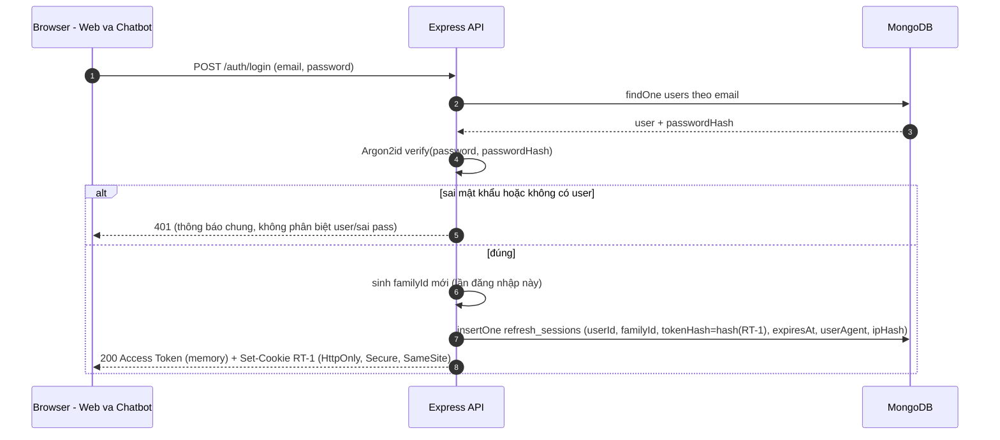
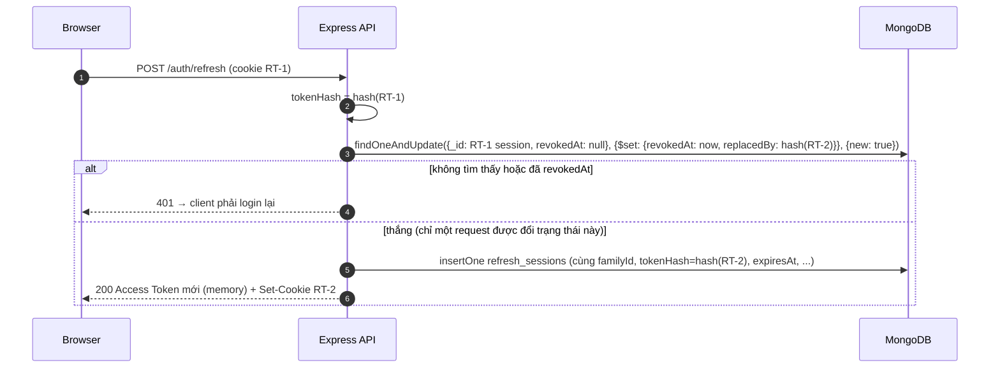
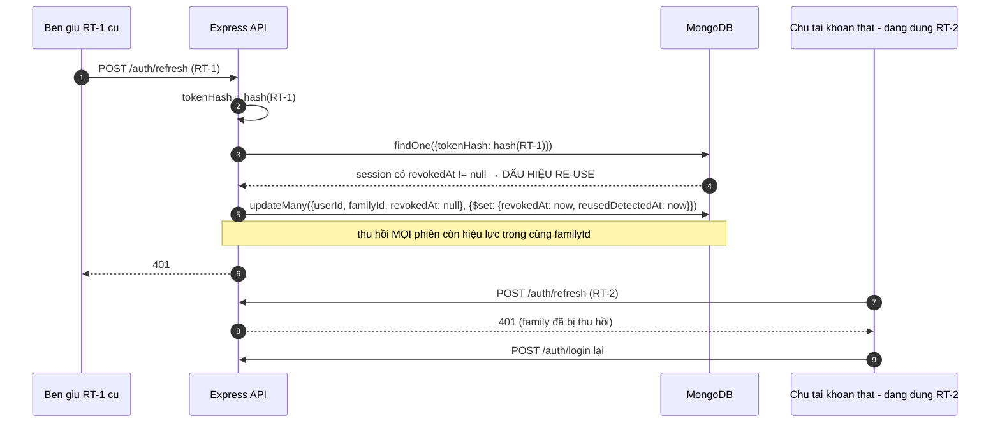
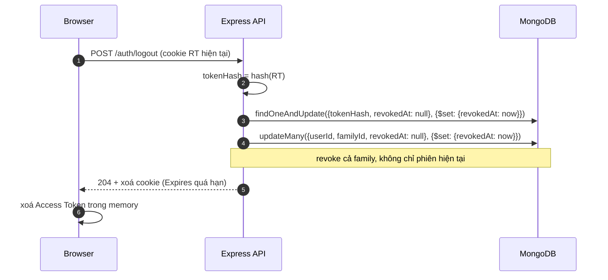

# 07 — Auth & Phân quyền (RBAC)

Khóa luận KLCN133. File này đặc tả **mô hình quyền 2 trục**, **vòng đời token với Refresh Token Rotation
(RTR)**, **password hashing**, **permission matrix cho tool catalog** và **checklist bảo mật theo OWASP**.
Nó thi hành các quy tắc BR-05, BR-06, BR-19 đã chốt ở `04-domain-model.md` §5 và dùng đúng schema
`refresh_sessions` ở `05-data-model.md` §3.10.

## 0. Nguồn và ký hiệu

Như `04-domain-model.md` §0. Riêng file này có thêm một nguyên tắc: **mọi con số TTL/ngưỡng đều là `TBD`**
vì `NOTES-01 B3` không đưa số nào. Điền số thật vào cấu hình rồi mới ghi vào báo cáo — không đoán ở đây.

---

## 1. Mô hình quyền: 2 role hệ thống × 5 level nghiệp vụ

`NOTES-01 B3` ra quyết định, đánh dấu `(!)` vì nó **đảo ngược** giả định "RBAC 2 vai × 5 cấp bậc" của
`RESEARCH-PLAN §3 B3` (plan hỏi "permission matrix hay role hierarchy?"):

```text
role  = Admin | Employee          → quyền hệ thống
level = Intern | Junior | Middle | Senior | Lead   → dữ liệu nghiệp vụ
```

| Trục | Sống còn với | Nơi lưu | Không được dùng để |
|---|---|---|---|
| `role` | cho phép / từ chối một hành động; xuất hiện trong JWT và trong RBAC check mỗi tool call | `users.role` (`05-data-model.md` §3.1) | — |
| `level` | mô tả hồ sơ: 5 bậc nhân sự của F1 | `employees.level` (enum, `05-data-model.md` §3.2) | **không** mở khoá permission, **không** xuất hiện trong JWT authorization claim `// SUY DIỄN — cần xác nhận` (cách loại trừ), **không** là đầu vào công thức KPI (`04-domain-model.md` §3) |

Bốn hệ quả thiết kế, tất cả từ `B3`:

1. **Không role hierarchy.** Chỉ có 2 giá trị role phẳng; không có `Manager`, không có kế thừa role. Câu hỏi
   "`Lead` có phải `Admin` không" **không có trong nguồn** → đang là `Q-09` ở `04-domain-model.md` §9; tạm
   thời **Lead là Employee**, tức Lead không có quyền Admin `// SUY DIỄN — cần xác nhận`.
2. **Không cần CASL ở MVP.** `B3` chốt nguyên văn "Không cần CASL ở MVP với chỉ hai role" → phân quyền bằng
   **hàm check thuần trong ứng dụng**, không thêm thư viện/abstraction (đúng `RP §4`: không tự thêm lớp).
3. **Permission là hàm của (role, action, resource-owner)**, không phải danh sách lưu trong DB — vì không có
   collection `permissions`/`roles` trong 11 collection của `B4`.
4. **Employee bị giới hạn theo sở hữu (ownership)**: dữ liệu của chính mình. `B6` đặt tên tool rõ ràng
   (`get_my_profile`, `get_my_kpi`, `list_projects` vs `get_employee`, `get_department_kpi`) và chỉ
   `assign_project` + `override_kpi` mang nhãn `Admin` → cách phân vùng chi tiết là
   `// SUY DIỄN — cần xác nhận` (BR-16 ở docs 04).

Bốn hệ quả trên **chưa đủ** để chặn một Admin đọc số liệu của phòng ban khác: chiều bị thiếu là **scope**,
không phải role thứ ba — đặc tả ở §7.4 (`19` §2.3(a)). `role` vẫn **đúng 2 giá trị**.

---

## 2. Token: Access vs Refresh

| Thuộc tính | Access Token | Refresh Token (RT) |
|---|---|---|
| Nơi chứa phía client | **memory** (biến trong app, mất khi reload) | **HttpOnly + Secure + SameSite** cookie |
| Lưu ở server | không | MongoDB `refresh_sessions` — **chỉ lưu HASH**, không lưu token gốc |
| Mục đích | gọi API, được Socket.IO handshake xác nhận | đổi lấy cặp token mới (rotation) |
| Thời hạn | `TBD — chốt ở cấu hình` ("TTL ngắn", theo `B3`; **nguồn không cho số**) | `TBD — chốt ở cấu hình` (dẫn xuất từ `expiresAt` của `refresh_sessions`, `B3`/`B4`; **nguồn không cho số**) |
| Thư viện ký/verify | `jose` | `jose` (cùng thư viện) |
| Có bị rotate không | không | **có** — mỗi lần refresh: invalidate RT-1 → issue RT-2 |
| Phát hiện đánh cắp | — | **re-use detection**: RT cũ xuất hiện lại ⇒ revoke **TOÀN BỘ family** |

Bằng chứng nguồn: `B3` — *"Web: Access Token ở **memory**; Refresh Token ở **HttpOnly + Secure + SameSite**;
Mongo chỉ lưu **hash**"* và *"JWT library: `jose` — đang được maintain, hỗ trợ JWT/JWS/JWE/JWK/JWKS, không
phụ thuộc package khác"*. Cơ sở chuẩn: *"RFC 9700 khuyến nghị refresh-token rotation hoặc sender-constrained
refresh token cho public clients. Token cũ bị dùng lại = dấu hiệu token family có thể đã bị đánh cắp."*

Hai loại client theo `RP §3 B3` (web + chatbot): cả hai là **browser client** (dashboard React và chatbot
React cùng nằm trên web), nên dùng chung khuôn trên `// SUY DIỄN — cần xác nhận` — `NOTES-01` không mô tả
client thứ hai khác biệt.

**Nội dung Access Token (claims).** `NOTES-01` **không** nêu claim nào. Docs đề xuất tối thiểu:

```text
sub : userId          // SUY DIỄN — cần xác nhận
role: Admin|Employee  // SUY DIỄN — cần xác nhận (cần cho RBAC mỗi request)
iat, exp              // SUY DIỄN — cần xác nhận
```

Không nhét `level`, `departmentId`, `skills` vào token: `level` là dữ liệu đọc được từ DB và **không** có
nghĩa quyền (§1), nên để trong token chỉ tạo thêm nguy cơ claim lỗi thời.

---

## 3. Sequence diagram

Bốn luồng dưới đây **dịch trực tiếp** sơ đồ chữ trong `NOTES-01 B3`:

```text
LOGIN → Access Token + Refresh Token
  → Refresh → invalidate RT-1 → issue RT-2
  → RT-1 xuất hiện lại?  no → tiếp tục
                         yes → revoke TOÀN BỘ family
```

### 3.1 Login



`familyId` sinh **một lần cho mỗi login**; mọi RT kế tiếp trong cùng chuỗi giữ nguyên nó — đó là cái bị thu
khi phát hiện re-use (§3.3).

### 3.2 Refresh bình thường (RT còn hiệu lực)



Cập nhật **có điều kiện** (`revokedAt: null`) là điểm làm cho rotation an toàn khi có hai request refresh
đồng thời: chỉ một request thấy `revokedAt` chuyển từ `null` → có giá trị; request còn lại rơi vào nhánh
401/re-use. Đây là cùng khuôn *atomic conditional update* mà `05-data-model.md` §5 đã chốt cho F2 (quyết định
`B1`), **không** dùng transaction.

### 3.3 Re-use RT-1 ⇒ revoke toàn bộ family



Hành vi này đúng hai dòng cuối của `B3`: *"RT-1 xuất hiện lại? no → tiếp tục / yes → revoke TOÀN BỘ family"*,
lý do *"Token cũ bị dùng lại = dấu hiệu token family có thể đã bị đánh cắp"*. Không có nhánh "cho qua vì vẫn
còn hạn dùng".

`updateMany` theo `familyId` cần index `(userId, familyId)` (I-18 ở `05-data-model.md` §4.1), và có thể là
**partial index** trên `revokedAt: null` (§4.2 docs 05).

### 3.4 Logout



Logout **có chủ đích** revoke toàn family (không chỉ RT hiện tại) để một thiết bị bị đánh cắp không thể tiếp
tục refresh qua các phiên anh em của nó `// SUY DIỄN — cần xác nhận` — `B3` chỉ định nghĩa revoke-family cho
tình huống re-use, **không** nói gì về logout. Access Token đã phát hành vẫn còn hiệu lực tới khi hết hạn
`exp` (đó là lý do TTL access phải ngắn); `NOTES-01` **không** nêu cơ chế blacklist access token → không có
trong MVP (bảng control ở mục 9, dòng 12).

---

## 4. Đặc tả hành vi phía server

| Việc | Hành vi đã chốt | Nguồn |
|---|---|---|
| Ký/verify JWT | `jose`; **không** dùng `jsonwebtoken` (câu hỏi so sánh của `RP §3 B3` được `B3` trả lời bằng `jose`) | `B3` |
| Lưu RT | chỉ `tokenHash`; thuật toán hash: `TBD` — `B3` chỉ nói "Mongo chỉ lưu hash", **không** nêu HMAC/SHA-256. Docs khuyến nghị hash có khoá (HMAC-SHA-256 với server-side secret) `// SUY DIỄN — cần xác nhận` | `B3` |
| `ipHash` | hash của IP, **không** lưu IP thô; thuật toán `TBD` (nên dùng cùng khoá với `tokenHash`) `// SUY DIỄN` | `B3` (có field), docs (cách) |
| `userAgent` | lưu chuỗi nguyên `user-agent` của request login `// SUY DIỄN — cần xác nhận` | `B3` (có field), docs (xử lý) |
| Dọn phiên hết hạn | **TTL index** trên `expiresAt` để MongoDB tự xoá; không viết job riêng `// SUY DIỄN` | `B4` (expiresAt TTL) |
| Cookie flags | `HttpOnly`, `Secure`, `SameSite` — giá trị cụ thể của `SameSite` (`strict`/`lax`) và `Path`/`Domain`: `TBD — chốt ở cấu hình`, vì còn phụ thuộc frontend và API ở hai domain (`Vercel/Netlify` vs `Render/VPS`, `RP §1`) | `B3`, `README.md` |
| CORS | `B3`/`B4` **không** nêu gì → **không có trong checklist mục 9**, xếp vào "chưa xác minh" | `RP §3 B3` |
| Error khi refresh fail | trả 401, client xoá access token trong memory và chuyển về màn hình login; **không** thử refresh lại tự động trong cùng trang `// SUY DIỄN` | hành vi suy ra từ §3.3 |

---

## 5. Bảng field `refresh_sessions`

Nguồn field: `NOTES-01 B3` (`_id` + 8 field); nguồn index/ràng buộc: `NOTES-01 B4`
(`tokenHash UNIQUE / expiresAt TTL`). Schema Mongo: `05-data-model.md` §3.10.

| Field | Kiểu | Ràng buộc | Nguồn | Vai trò trong rotation |
|---|---|---|---|---|
| `_id` | ObjectId | PK | Mongo default | định danh document |
| `userId` | ObjectId | required | `B3` | biết phiên của ai; dùng khi revoke theo family |
| `familyId` | string | required | `B3` | **chuỗi RT cùng gốc** — đơn vị bị thu hồi khi re-use |
| `tokenHash` | string | required, **UNIQUE** | `B3`, `B4` | tra RT đến bằng hash; UNIQUE bảo đảm một token chỉ khớp một phiên |
| `expiresAt` | Date | required, **TTL** | `B3`, `B4` | hạn dùng của RT; giá trị khởi tạo = `TBD` (mục 2) |
| `revokedAt` | Date? | null khi còn hiệu lực | `B3` | điều kiện của *atomic conditional update* (§3.2); có giá trị = đã invalidate |
| `replacedBy` | string? | null cho tới khi rotate | `B3` | hash của RT kế tiếp → dựng được chuỗi kế thừa để điều tra |
| `userAgent` | string? | — | `B3` | bằng chứng ngữ cảnh phiên |
| `ipHash` | string? | — | `B3` | bằng chứng ngữ cảnh, không lộ IP thô |
| `createdAt` | Date | required | `// SUY DIỄN — cần xác nhận` | sắp xếp lịch sử phiên, debug re-use |
| `reusedDetectedAt` | Date? | optional | `// SUY DIỄN — cần xác nhận` | đánh dấu **lần** re-use bị phát hiện (khác `revokedAt` — cái này là nguyên nhân, không phải hệ quả); để báo cáo S-series/13-security có số liệu thống kê |

Hai field cuối **không** có trong `B3`. Nếu nhóm muốn giữ đúng 9 field của nguồn thì `reusedDetectedAt` bị bỏ
và thông tin re-use chỉ còn trong log ứng dụng — quyết định này cần chốt, không âm thầm thêm.

`replacedBy` cũng chưa được nguồn định nghĩa là trỏ tới `_id` hay `tokenHash` → docs chọn **`tokenHash` của
RT kế tiếp** `// SUY DIỄN — cần xác nhận` (D-01 ở `05-data-model.md` §7).

---

## 6. Password hashing

| Hạng mục | Nội dung | Nguồn / trạng thái |
|---|---|---|
| Thuật toán | **Argon2id** — "Argon2id > bcrypt cho project mới" | `NOTES-01 B3` |
| Tham số | **~19 MiB memory, 2 iterations, parallelism 1** (đúng con số `B3` ghi là "cấu hình được liệt kê") | `NOTES-01 B3` |
| Cơ sở chuẩn | OWASP khuyến nghị Argon2id | `NOTES-01 B3` |
| URL cheat sheet Argon2 | `[CẦN NGUỒN]` — `NOTES-01` dòng "OWASP cheat sheet (Argon2id)" nằm trong mục **CẦN BỔ SUNG** ("URL ... bị mất khi paste"), nên **không** dẫn URL ở đây và không được chép con số trên vào báo cáo như số liệu đã kiểm chứng | `NOTES-01` (dòng 6–9, mục CẦN BỔ SUNG #2) |
| Thư viện Node để dùng | **chưa chốt** — `RP §3 B3` hỏi "argon2 vs bcrypt node", `NOTES-01 B3` chỉ chốt *thuật toán*, không chốt *package* `// SUY DIỄN — cần xác nhận` | — |
| Chuỗi lưu trong DB | `users.passwordHash` (`05-data-model.md` §3.1); **không** bao giờ trả về qua API; **không** log | `// SUY DIỄN` |
| So sánh khi verify | dùng hàm verify của thư viện Argon2, không tự so sánh chuỗi | thực hành chuẩn, **không** có trong `NOTES-01` → xếp vào "chưa xác minh" ở mục 9 |
| Đổi tham số sau này | Argon2 embed tham số trong encoded hash nên có thể nâng cấp dần và re-hash khi user đổi mật khẩu `// SUY DIỄN` | — |
| Rate limit đăng nhập / khoá tài khoản sau N lần sai | `RP §3 B3` có hỏi, `NOTES-01 B3` **không trả lời** → **UNRESOLVED**, không tự đặt N. Ghi ở mục 9 (dòng 10, 11). | `RP §3 B3` |

Ghi chú về tính trung thực của số: `B3` tự nó nói *"cấu hình **được liệt kê**: ~19 MiB memory, 2 iterations,
parallelism 1"* mà **không kèm URL**. Docs này chép lại đúng số đó và đánh dấu `[CẦN NGUỒN]` — không được
"làm tròn" hay thay bằng tham số khác khi chưa có nguồn.

---

## 7. Permission matrix

Hàng = **action**, lấy từ tool catalog `NOTES-01 B6` và user flow `NOTES-01 B0`. Cột = **role** (`level`
không xuất hiện ở đây, §1). Giá trị = allow / deny, kèm **confirm** (BR-05) và **ownership**.

Ký hiệu: ✅ = allow; ❌ = deny; ⛳ = bắt buộc confirm trước khi ghi; 🔒 = **Admin-only** theo nhãn tường minh
trong `B6`; *(own)* = chỉ dữ liệu của chính người dùng.

### 7.1 Tool đọc

| Action (tool) | UF | Admin | Employee | Điều kiện / ghi chú |
|---|---|---|---|---|
| `get_my_profile` | UF-01 | ✅ | ✅ *(own)* | đọc `users` + `employees` |
| `get_employee` (người khác) | UF-01 | ✅ | ❌ | catalog `B6` không gắn nhãn Admin cho tool này → phân vùng **`// SUY DIỄN`** (BR-16 docs 04) |
| `list_projects` | UF-05 | ✅ (toàn bộ, có scope) | ✅ *(own: `assigneeIds` chứa mình)* | `// SUY DIỄN` cho chiều "Admin thấy hết" |
| `get_project` | UF-05 | ✅ | ✅ nếu own | cùng logic ownership |
| `get_my_kpi` | UF-06 | ✅ (của mình) | ✅ *(own)* | `get_my_kpi` có tên "my" → mặc định own |
| `get_department_kpi` | UF-06 | ✅ | ❌ | phòng ban là scope Admin `// SUY DIỄN` |
| `find_candidates` | UF-04 | ✅ | ❌ | quản lý chọn người, không phải nhân viên `// SUY DIỄN` |
| `explain_candidate_match` | UF-04 | ✅ | ❌ | đi kèm `find_candidates` |
| `search_policy` | UF-10 | ✅ | ✅ | chatbot HR phục vụ nhân viên là chính; trả lời phải kèm document/version/source (BR-15) |
| `get_upcoming_deadlines` | UF-05, UF-09 | ✅ | ✅ *(own)* | công cụ nhắc hạn |
| NL→aggregation (S10, template đã duyệt) | UF-06, F6 | ✅ | ✅ **chỉ template trong whitelist + scope do server inject** | `B15`; row cap + timeout; rủi ro **Cao** (`RP §9 S10`) |

### 7.2 Tool ghi (mọi dòng đều ⛳)

| Action (tool) | UF | Admin | Employee | Điều kiện |
|---|---|---|---|---|
| `submit_progress` | UF-05 | ✅ | ✅ *(own project)* | ⛳; transition T-06 (`04-domain-model.md` §4.3); audit event bắt buộc |
| `submit_report` | UF-05, F7 | ✅ | ✅ *(own project)* | ⛳; transition T-04; `B0` ghi rõ `submit_report → confirm → reportService.create()` |
| `change_project_status` | UF-05 | ✅ | ⛳ (chỉ transition của mình: T-03, T-04) | ⛳; **Employee không được approve/reject** — `change_project_status` không có nhãn Admin trong `B6`, nhưng hai cửa ra của `PENDING_REVIEW` là quyết định duyệt → để Admin `// SUY DIỄN` cho chi tiết phân chia |
| `assign_project` | UF-04, UF-05 | ✅ 🔒 | ❌ | ⛳ + **Admin** — nhãn trong `B6`: `assign_project (confirm + Admin)`; transition T-02 |
| `override_kpi` | UF-06 | ✅ 🔒 | ❌ | ⛳ + **reason** + **Admin** — nhãn trong `B6`: `override_kpi (confirm + reason + Admin)`; BR-09 |
| Phê duyệt thay đổi field nhạy cảm của hồ sơ | UF-01 | ✅ | ❌ | `B0` UF-01 có bước "duyệt nếu field nhạy cảm" — **không** có tool nào trong `B6` cho việc này `// SUY DIỄN` |
| Phản hồi phân công — `ACKNOWLEDGE` / `DECLINE` / `REQUEST_CHANGE` (`POST /projects/:id/acknowledgement`, `06 §2.4`) | UF-04, UF-05 | ❌ — **không** có đường phản hồi với tư cách Admin; nếu chính Admin nằm trong `assigneeIds` thì đi đúng đường `own` như Employee, **không** phải quyền Admin | ✅ **(own)** — **chỉ** actor có tên trong `assigneeIds`, **bất kể `role`** (BR-16, SC-04) | ⛳ **confirm** (write tạo thay đổi nghiệp vụ); `reasonCode` **bắt buộc** với `DECLINE`/`REQUEST_CHANGE` + `comment` optional (**PROPOSED** — `06 §2.4`); ghi `project_events` type `ACKNOWLEDGED`/`DECLINED`/`CHANGE_REQUESTED` (`05 §3.5`), **không** đổi `projects.status`; người gọi ngoài `assigneeIds` → `NOT_ASSIGNEE` (`06 §5`); **tên tool chưa có trong catalog `B6`** `// SUY DIỄN — cần xác nhận` + `[CẦN NGUỒN]` |
| Duyệt phản hồi phân công (xử lý/đóng phản hồi) | UF-04, UF-05 | ❌ — **chưa có đường thực thi**: `POST /projects/:id/assign` (`assign_project`) chỉ hợp lệ ở `DRAFT` nên **không** gán lại được đề tài `ASSIGNED`, và **chưa** có endpoint/transition nào để *đóng* một phản hồi `DECLINED`/`CHANGE_REQUESTED` (`04 §9` Q-10, `06 §8` D-15). Khi đường đó tồn tại thì đây là `✅ 🔒` **trong scope (§7.4) + Admin**; **SC-03**: không xử lý phản hồi do chính mình tạo → `SELF_APPROVAL` `// SUY DIỄN` |

**Toàn bộ cột "Admin" ở §7.1 và §7.2 còn bị chặn thêm bởi §7.4 (scope)** — `✅` nghĩa là "được làm **trong
`departmentId` được gán**", không phải "toàn công ty" `// SUY DIỄN — cần xác nhận` (chiều scope không có trong
`B3`).

### 7.3 Action chỉ có trong REST/dashboard, không phải tool chatbot

| Action | Admin | Employee | Nguồn / ghi chú |
|---|---|---|---|
| CRUD `departments` | ✅ | ❌ (đọc phòng mình) | F1 (`RP §1`); `B4` có collection. **Không** có tool nào trong `B6` → làm qua REST `// SUY DIỄN` |
| CRUD `employees` + gán `level`, `skills` | ✅ | ❌ (chỉ sửa field của mình theo UF-01) | F1 |
| Tạo `projects` ở `DRAFT` | ✅ | ❌ | transition T-01 |
| Import `policies` + tạo chunk/embedding | ✅ | ❌ | `B6` RAG; là thao tác vận hành |
| Đánh dấu notification đã đọc | ✅ (của mình) | ✅ (của mình) | `B4` index `(userId, readAt, createdAt)` |
| Đọc `feedback_events` để hiệu chỉnh ngưỡng/reranker | ✅ | ❌ | `RP §9 S4` |
| Đăng xuất thu hồi phiên | ✅ (của mình) | ✅ (của mình) | §3.4 |
| Xoá / sửa `project_events`, `statusHistory` | ❌ | ❌ | **không ai** — append-only (BR-03 docs 04) |
| Thay đổi tham số Argon2id, TTL token, giới hạn | qua **config/migration**, không qua UI | ❌ | `// SUY DIỄN` |

Không có action nào cho `level` mở quyền (§1). Mọi dòng ⛳ ở trên là **điểm bắt buộc có bước xác nhận** —
chatbot phải hiển thị "tôi sắp làm X, bạn có chắc không?" rồi mới gọi service (BR-05 docs 04).

### 7.4 Thực thi scope — Admin bị chặn theo `departmentId` được gán

`19` §2.3(a) + §3 chốt: **không** thêm role thứ ba, nhưng **phải** thêm **thực thi scope**. Đây là ràng buộc
quyền, không phải tính năng.

```text
role  = Admin | Employee        ← vẫn ĐÚNG 2 giá trị (B3, ADR-009); không có Manager, không có role mới
scope = giá trị departmentId trên hồ sơ của chính người dùng   ← chiều bị thiếu, docs đặt
```

Nguồn ủng hộ: trang 7shifts "Manager Permissions" / "Approve Availability Requests" (đã kiểm chứng ở `19` §1)
mô tả quyền duyệt của quản lý gắn với điều kiện *"…who has the permission 'Can manage other employees'
availability' enabled, **and is assigned to the same Department** as the Employee"* — tức ngành giải quyết bài
toán "ai được duyệt" bằng **permission + scope**, không bằng cách nâng role. `NOTES-01` **không** có mô hình
scope nào (`B3` chỉ định nghĩa `role` và `level`) → chi tiết dưới đây là `[CẦN NGUỒN]`.

Bốn quy tắc bắt buộc:

| # | Quy tắc | Hệ quả ở tầng code | Trạng thái |
|---|---|---|---|
| SC-01 | **Admin chỉ thao tác trong `departmentId` được gán** trên hồ sơ của mình: đọc (`get_employee`, `list_projects` chéo phòng, `get_department_kpi`, `find_candidates`) và ghi (`assign_project`, `change_project_status`; còn bước **xử lý/đóng phản hồi** chỉ tính khi đường đó tồn tại — Q-10) | một hàm `assertInScope(actor, resource)` chạy **trước** query, ở **service layer** — không phải middleware đọc header, không phải filter ở UI | `[CẦN NGUỒN]` cho chỗ lưu scope |
| SC-02 | **Không tin client**: `departmentId`/`userId` trong payload hay trong đối số tool chỉ là *yêu cầu lọc*, phải đối chiếu với scope nạp từ phiên đã verify (cùng khuôn ADR-014 mục 4 / `§B15` "server inject scope") | `RBAC_DENIED` (403) khi yêu cầu nằm ngoài scope; **không** trả dữ liệu một phần (catalog `06 §5`) | kế thừa quyết định đã chốt |
| SC-03 | **Self-approval guard**: không ai được duyệt/phê chuẩn một yêu cầu do **chính mình tạo** — kể cả Admin. Áp dụng cho `reports/:id/review`, `override_kpi`, và bước xử lý phản hồi phân công (`06 §2.4`) | so `actorId` của hành động duyệt với `createdBy` của bản ghi được duyệt (với phản hồi phân công: so với `actorId` của chính `project_events` phản hồi đó); bằng nhau → từ chối (`06 §5` `SELF_APPROVAL`), **không** ghi event | `[CẦN NGUỒN]` — `NOTES-01` không có khái niệm separation of duties; nguồn ý tưởng: `NOTES-02` §E VC-01 ("Manager không tự approve request của chính mình nếu cùng actor") |
| SC-04 | **Employee giữ quyền own** như cũ (`B6` cách đặt tên `get_my_*`, BR-16): scope của Employee là **sở hữu**, không phải phòng ban | phản hồi phân công chỉ thực hiện được trên đề tài có `employeeId` của mình trong `assigneeIds` | đã chốt ở `06 §2.4` |

Hai khoảng trống phải chốt trước khi code, **không** được âm thầm vá:

1. **Scope lưu ở đâu**: `05 §3.1` (`users`) và `05 §3.2` (`employees`) **không** có field scope nào; phương án
   ít xâm phạm nhất là suy scope từ `employees.departmentId` của chính tài khoản Admin (một phòng ban), còn
   "một Admin quản nhiều phòng" sẽ cần **thêm field** → chạm ràng buộc 11 collection (`05 §1.1`). Docs **không**
   tự thêm field. → `[CẦN NGUỒN]` + GVHD, ghi là D-13 ở `06 §8`.
2. **Admin toàn công ty**: nếu GVHD muốn có super-admin không giới hạn, đó là **một capability flag** ở server
   chứ **không** phải role thứ ba (`19` §3 hàng "`Manager` role thứ ba" = **KHÔNG**). Tên flag và cách gán:
   `TBD` — `[CẦN NGUỒN]`.

Scope **không** thay thế RBAC mỗi tool call (§8 mục 3) mà là **lớp thứ hai**: `role` trả lời "được làm loại
hành động này không", `scope` trả lời "được làm với **dữ liệu của ai/phòng nào**". Thiếu một trong hai là
`13` §2.5 (IDOR) và §2.15–§2.17 (ba threat mới từ vòng đánh giá này).

---

## 8. Session & transport (Socket.IO)

`NOTES-01 B7` + `B6` đặt ba ràng buộc, và cả ba đều **không được nới** cho tiện:

1. **Xác thực trong handshake.** Client gửi access token qua `socket.handshake.auth`; server verify bằng
   `jose` **trước khi** cho kết nối, rồi mới cho vào room. Không cho phép kết nối ẩn danh rồi "auth sau"
   `// SUY DIỄN` (chi tiết: `B7` mô tả trong `RP §3 B7`, còn `NOTES-01 B7` chỉ chốt rooms/events — đường
   verify JWT lấy từ `B3` + `RP §3 B7`).
2. **Room theo dữ liệu đã xác thực**: `user:<userId>` và `department:<departmentId>` — id lấy từ **JWT đã
   verify**, không từ payload client gửi lên `// SUY DIỄN`.
3. **RBAC check ở MỖI tool call**, không phải mỗi kết nối. Chuỗi pipeline bắt buộc theo `B6`:

```text
User → Intent/router → Agent → Tool selection → Zod validate → Permission check
  ├─ Read tool  → execute
  └─ Write tool → confirmation → execute
→ structured result → LLM response

Guard: maxSteps = 5 | toolTimeout | LLM timeout | max tool result size
       RBAC check every tool | Zod validate every argument
       confirm write operations | audit every mutation
```

Một socket đã auth **không** mang quyền vĩnh viễn: người dùng bị đổi `role` thì access token cũ còn hạn tới
`exp`, nên permission phải đọc **role hiện tại** hoặc token phải đủ ngắn để cửa sổ này chấp nhận được
(TTL: `TBD`, mục 2) `// SUY DIỄN — cần xác nhận`.

4. **Audit mọi mutation** (`B6`): mỗi tool ghi ghi `project_events` (hoặc bản ghi audit tương ứng) kèm
   `actorId`, `tool`, `clientMessageId`, `source: 'chatbot'` — trường hợp một hành động được thực hiện **hai
   lần** (một qua REST, một qua chat) vẫn truy vết được là ai, qua đâu.
5. **Idempotency cho message**: mỗi client message có `clientMessageId`; server bỏ qua id đã thấy
   (`B7`: "Mỗi client message cần `clientMessageId` để chống duplicate khi reconnect/retry").
6. **Thông báo bền vẫn phải persist phía app** (`B7`) — `notifications` là collection thật, socket chỉ là
   kênh khuếch đại; client offline nhận lại khi mở lại, đọc `readAt` từ DB.
7. **Một namespace** (`B7`: "Không cần 2 namespace ngay"); events: `chat:send chat:accepted chat:chunk
   chat:done chat:error`, `notification:new project:updated report:updated kpi:updated`.
8. **Không Redis adapter** ở MVP (`B1`, `B7`) → không scale nhiều instance; ghi rõ trong `02-architecture.md`.

---

## 9. Checklist OWASP-aligned — chỉ những gì có bằng chứng trong NOTES-01

Ba trạng thái: **ĐÃ LÀM** (có quyết định + schema/flow trong docs), **CHƯA LÀM** (nguồn nêu nhưng MVP không
triển khai), **CHƯA XÁC MINH** (nguồn im lặng — **không** được ghi là đã làm).

| # | Control | Trạng thái | Bằng chứng / khoảng trống |
|---|---|---|---|
| 1 | Mật khẩu băm bằng thuật toán được khuyến nghị (Argon2id) | **ĐÃ LÀM** (thiết kế) | `B3` + §6 |
| 2 | Refresh token **rotation** | **ĐÃ LÀM** (thiết kế) | `B3` + §3.2 |
| 3 | Phát hiện re-use + thu hồi cả family | **ĐÃ LÀM** (thiết kế) | `B3` + §3.3 |
| 4 | RT không nằm dạng thô trong DB — chỉ hash | **ĐÃ LÀM** (thiết kế) | `B3` (`tokenHash` UNIQUE) |
| 5 | RT ở cookie `HttpOnly + Secure + SameSite` | **ĐÃ LÀM** (thiết kế); giá trị `SameSite` và `Domain`/`Path` `TBD` | `B3` + mục 4 |
| 6 | Access token không nằm trong localStorage | **ĐÃ LÀM** (memory, `B3`) | `B3` + mục 2 |
| 7 | Thư viện JWT còn được maintain | **ĐÃ LÀM** — `jose` | `B3` |
| 8 | TTL access / TTL refresh cụ thể | **CHƯA XÁC MINH** | `B3` không cho số → `TBD`, chốt ở cấu hình (mục 2) |
| 9 | Thuật toán hash cho `tokenHash`/`ipHash` | **CHƯA XÁC MINH** | `B3` chỉ nói "hash"; khuyến nghị HMAC-SHA-256 `// SUY DIỄN` (§4) |
| 10 | Rate limit đăng nhập | **CHƯA XÁC MINH** | `RP §3 B3` hỏi, `NOTES-01 B3` không trả lời |
| 11 | Khoá tài khoản sau N lần sai | **CHƯA XÁC MINH** | như 10; không tự đặt N |
| 12 | Danh sách thu hồi (deny-list) cho access token đã phát hành | **CHƯA LÀM** | `B3` không nêu; chỉ dựa vào TTL ngắn (§3.4) |
| 13 | RBAC mỗi lần thực thi tool | **ĐÃ LÀM** (thiết kế) | `B6` guard "RBAC check every tool" + §7 |
| 14 | Confirm-before-write cho tool ghi (S8) | **ĐÃ LÀM** (thiết kế) | `B6`, `B0`, `RP §9 S8`, BR-05 docs 04 |
| 15 | Zod validate mọi tham số LLM trả về | **ĐÃ LÀM** (thiết kế) | `B6` guard + `B2` contract pipeline |
| 16 | Audit mọi mutation | **ĐÃ LÀM** (thiết kế) | `B6`, `B4` (`project_events`), BR-03/BR-19 docs 04 |
| 17 | Không cho LLM sinh query tự do (S10) | **ĐÃ LÀM** (thiết kế) | `B15`: whitelist template + row cap + timeout; BR-14 docs 04 |
| 18 | Secret scanning trong CI (`gitleaks`) | **ĐÃ LÀM** (kế hoạch CI) | `B10` pipeline + `RP §11` gate "1 secret leak = fail build" |
| 19 | Không đưa secret/join key vào repo; `.env`/config tách bạch | **CHƯA XÁC MINH** | `B2` có `packages/config` nhưng `NOTES-01` không mô tả quản lý secret |
| 20 | Đường truyền TLS / HSTS | **CHƯA XÁC MINH** | chỉ suy ra từ `Secure` cookie `(B3)`; nền tảng hosting do `RP §1` chọn, `NOTES-01 B1` **mất URL** |
| 21 | PII nhân viên: thu thập tối thiểu, ai được đọc số điện thoại/hồ sơ nhạy cảm | **CHƯA XÁC MINH** | `B0` UF-01 có "field nhạy cảm → duyệt"; **không** có chính sách PII nào trong `NOTES-01`; `RP §2` dự định file `13-security.md` cho phần này |
| 22 | Header bảo mật (CSP, X-Frame-Options...) | **CHƯA XÁC MINH** | `NOTES-01` không nhắc |
| 23 | Kiểm tra phụ thuộc / CVE định kỳ | **CHƯA XÁC MINH** | `B10` liệt kê lint/typecheck/build/Lighthouse/gitleaks — không có bước audit dependency |
| 24 | Log không chứa token/mật khẩu | **CHƯA XÁC MINH** (docs khuyến nghị ở §6) | `NOTES-01` không nêu |
| 25 | Giới hạn upload file báo cáo (loại/kích thước) | **CHƯA XÁC MINH** | `B4` có `reports` nhưng `NOTES-01` không nói có upload file; `attachments` đang là `// SUY DIỄN` (docs 05 §3.6) |
| 26 | Multi-step approval / delegation (chuẩn ngành theo `B0`) | **CHƯA LÀM** | ngoài phạm vi MVP (`04-domain-model.md` §8) |
| 27 | danh sách ASVS controls áp dụng mà `RP §3 B3` yêu cầu nộp | **CHƯA XÁC MINH** | `NOTES-01 B3` không liệt kê mục ASVS nào; cần nguồn `[CẦN NGUỒN]` |

Con số **không** xuất hiện trong file này một cách tuỳ tiện: ngưỡng re-use, số lần đăng nhập sai, TTL, số
index, dung lượng. Lý do: `NOTES-01` dòng 6–9 khai **URL của các con số đã mất khi paste**, và mục CẦN BỔ SUNG
yêu cầu bổ sung trước khi bất kỳ số nào được chép vào báo cáo.

---

## 10. Việc phải chốt từ file này

| ID | Việc | Chặn | Thuộc |
|---|---|---|---|
| A-01 | TTL access + TTL refresh → thành con số trong cấu hình + `[CẦN NGUỒN]` | §2, §3, mục 12 checklist | nhóm |
| A-02 | `SameSite`/`Domain`/`Path` của cookie RT (frontend và API khác domain) | §4, mục 5 | nhóm + môi trường deploy |
| A-03 | Thuật toán hash cho `tokenHash` (raw SHA-256 hay HMAC với server secret) | §3.2, §5 | nhóm |
| A-04 | Package Argon2 cho Node + xác nhận tham số ~19 MiB / 2 iter / parallelism 1 bằng nguồn chính thức | §6 | nhóm + `[CẦN NGUỒN]` |
| A-05 | `Lead` có phải `Admin` không (Q-09 docs 04) | §1, matrix §7 | GVHD |
| A-06 | Phân vùng Employee ↔ `get_employee` / `find_candidates` / `list_projects` | §7 (các dòng `// SUY DIỄN`) | nhóm |
| A-07 | Có giữ `reusedDetectedAt` không | §5 | nhóm |
| A-08 | **Chỗ lưu scope của Admin**: suy từ `employees.departmentId` hay cần field riêng (một Admin nhiều phòng ban)? Kéo theo câu hỏi "có super-admin không giới hạn không" | §7.4 SC-01, `05 §3.1`/`05 §1.1` (11 collection), `06 §8` D-13 | nhóm + GVHD — `[CẦN NGUỒN]` |
| A-09 | **Tên tool chatbot** cho `ACKNOWLEDGE`/`DECLINE`/`REQUEST_CHANGE` (catalog 15 tool của `B6` chưa có) và cách đăng ký vào ràng buộc `E-01` | §7.2 (hai dòng mới), `06 §2.9.1`, `06 §8` D-14 | nhóm (`18-user-flows.md`) |
| A-10 | **Phạm vi của self-approval guard**: áp cho những hành động duyệt nào (`reports/:id/review`, `override_kpi`, và — **một khi đã có đường** — xử lý phản hồi phân công / gán lại đề tài, `04 §9` Q-10) và cách xác định "người tạo yêu cầu" khi yêu cầu sinh ra từ chatbot | §7.4 SC-03, `06 §5` `SELF_APPROVAL` | nhóm — `[CẦN NGUỒN]` |
