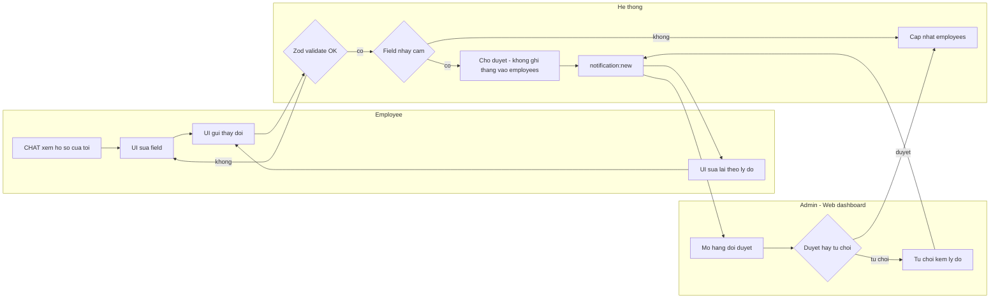
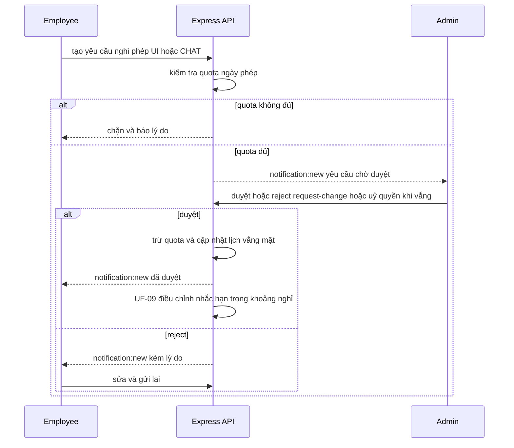
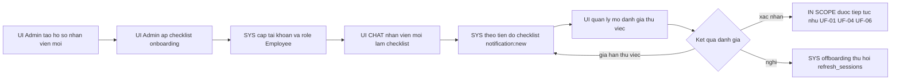
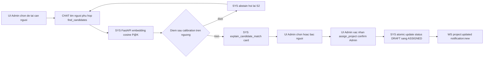
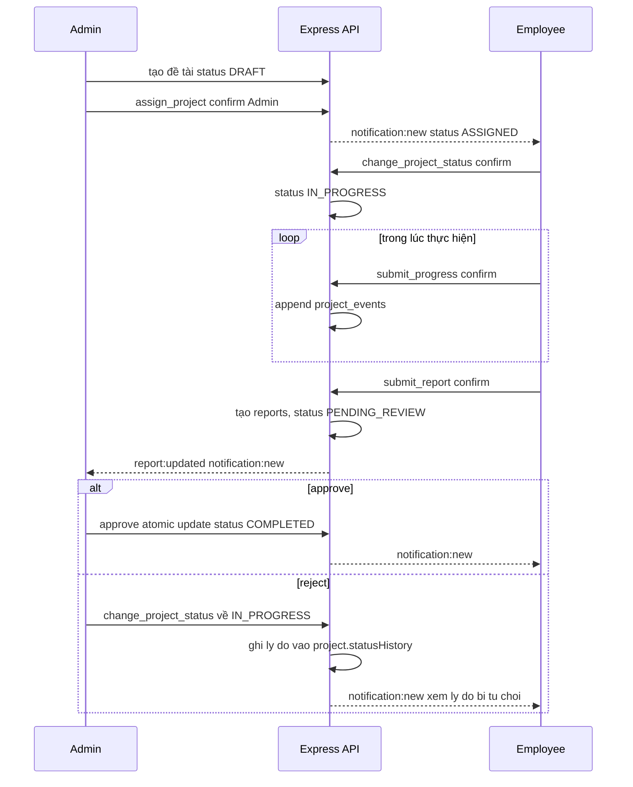
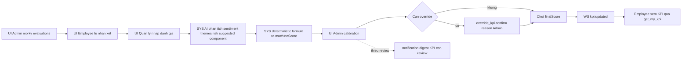
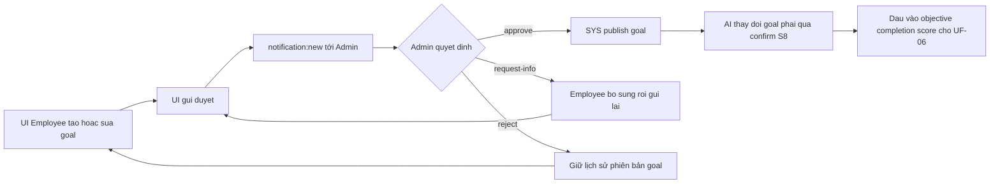
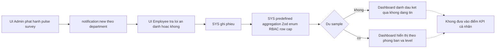
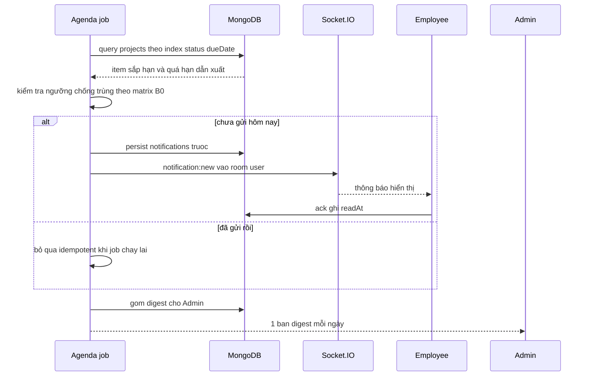
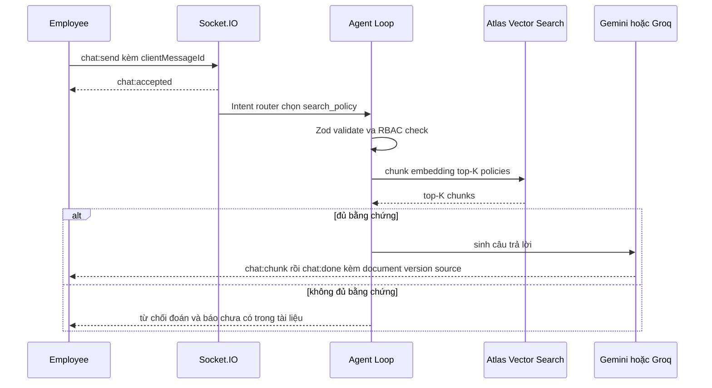

# 18 — User flows: hành trình & luồng thao tác 2 vai

- **Nguồn duy nhất của nội dung nghiệp vụ:** [`docs/research/NOTES-01.md`](research/NOTES-01.md), mục
  **"## B0 — Chuẩn ngành HRM → user flow"** (flow inventory UF-01..UF-10, catalog 28 intent, notification
  matrix), cộng phần dữ liệu kỹ thuật ở **B3** (RBAC: `role` vs `level`), **B4** (state machine + collections),
  **B6** (tool catalog + agent architecture), **B7** (Socket.IO events), **B15** (Agenda scheduler + whitelist
  NL→data).
- **Ngày:** 13/09/2026 (cùng ngày batch B0 nộp kết quả).
- **Phạm vi:** 7 chức năng F1..F7 theo [`README.md`](../README.md) và `RESEARCH-PLAN.md` §1.
- **Trạng thái scope:** **UF-02 (nghỉ phép), UF-03 (onboarding), UF-07 (goal/OKR), UF-08 (pulse survey)
  chưa được GVHD duyệt mở scope** → chỉ được mô tả ở mức thiết kế để không mất dấu, toàn bộ chi tiết dời sang
  [`backlog-parked.md`](backlog-parked.md). Căn cứ: NOTES-01 dòng 47 — "UF-02, UF-03, UF-07, UF-08 **nằm ngoài
  F1–F7 hiện tại** → để trong `docs/backlog-parked.md` tới khi GVHD duyệt".
- **Giới hạn dẫn chứng của file này:** bản nộp NOTES-01 bị **mất URL của các dòng "Nguồn Atlas / Render /
  Vercel / Netlify"** khi paste (NOTES-01 dòng 6–8), nên mọi con số/nhân chứng sản phẩm được chép vào đây đều
  **không kèm URL**. Những dòng cần dẫn chứng mà NOTES-01 không có nguồn được gắn marker `[CẦN NGUỒN]` —
  **không được copy các dòng đó vào báo cáo** trước khi nhóm bổ sung URL theo `RESEARCH-PLAN.md` §5.

Quy ước đọc file: **Chatbot** = kênh hội thoại (Agent Loop + tool, B6). **Web dashboard** = React + TypeScript +
shadcn/ui nền tối (B8, F6). Một bước ghi `[UI]` là thao tác trên Web dashboard, `[CHAT]` là qua chatbot,
`[SYS]` là hệ thống tự chạy (API, AI service, scheduler).

---

## Actors

### Hai vai, một trục quyền (`role`)

| Vai trong user flow | `role` (B3) | Vai trò nghiệp vụ | Quyền hệ thống |
|---|---|---|---|
| **Quản lý nhân sự** | `Admin` | Vận hành hồ sơ toàn công ty, tạo/giao đề tài, duyệt báo cáo nghiệm thu, chấm & hiệu chỉnh KPI, nhận digest | Được gọi tool `write` có ràng buộc Admin: `assign_project` (confirm + Admin), `override_kpi` (confirm + reason + Admin); xem được số liệu cấp phòng ban (`get_department_kpi`) |
| **Nhân viên** | `Employee` | Tự phục vụ hồ sơ của mình, nhận đề tài, gửi tiến độ/báo cáo, tự nhận xét KPI, hỏi chính sách | Tool `read` trong phạm vi của mình (`get_my_profile`, `list_projects`, `get_my_kpi`, `get_upcoming_deadlines`, `search_policy`); tool `write` không cần quyền Admin: `submit_progress`, `submit_report`. `change_project_status` **chỉ cho hai bước của chính nhân viên** (T-03 bắt đầu, T-04 nộp chờ duyệt), **không** dùng để approve/reject — duyệt là quyền Admin (T-05a/T-05b, đối chiếu `07-auth-rbac.md` §7) |

`NOTES-01` B3 chốt **chỉ hai `role`** và "Không cần CASL ở MVP với chỉ hai role". Mọi tool call đi qua
`Permission check` + `RBAC check every tool` (B6, agent architecture). Trong các flow bên dưới, "quản lý" /
"người duyệt" / "approver" đều là `role = Admin` — hệ thống **không có role thứ ba**.

### `level` là dữ liệu nghiệp vụ, không phải quyền

`NOTES-01` B3 tách tuyệt đối hai trục:

```text
role  = Admin | Employee          → quyền hệ thống
level = Intern | Junior | Middle | Senior | Lead   → dữ liệu nghiệp vụ
```

| Trục | Giá trị | Dùng để làm gì trong các flow dưới đây |
|---|---|---|
| `role` | `Admin`, `Employee` | Quyết định **được gọi tool nào** (cột `RBAC` trong catalog intent) và **được nhận notification nào** (notification matrix) |
| `level` | `Intern`, `Junior`, `Middle`, `Senior`, `Lead` | Là **field trên bản ghi nhân sự** (F1 "hồ sơ & phân cấp nhân sự"). Không xuất hiện trong bất kỳ điều kiện quyền nào: không có flow nào cho `Senior` nhiều quyền hơn `Employee`, và không flow nào cấm `Intern` dùng tool |

Vì vậy intent "xem cấp bậc" (intent #4) là **intent đọc dữ liệu**, không phải intent quản lý quyền.
`level` chỉ đi vào luồng nghiệp vụ ở chỗ nó là một tiêu chí của **matching** (UF-04) và của **KPI** (UF-06),
tức là dữ liệu đầu vào của thuật toán/chấm điểm, không phải khoá truy cập.

### Kênh và hạ tầng chung cho mọi flow

| Yếu tố | Giá trị | Nguồn |
|---|---|---|
| Phiên đăng nhập | Access Token ở memory, Refresh Token ở `HttpOnly + Secure + SameSite`, Mongo chỉ lưu `tokenHash`; refresh-token rotation, dùng lại token cũ → revoke toàn bộ `familyId` | B3 |
| Realtime | 1 instance `Socket.IO + MongoDB`, **không Redis**; rooms `user:<userId>` và `department:<departmentId>` | B7 |
| Event được phép dùng | `chat:send`, `chat:accepted`, `chat:chunk`, `chat:done`, `chat:error`, `notification:new`, `project:updated`, `report:updated`, `kpi:updated` — **9 tên duy nhất**, file này không dùng tên nào khác | B7 |
| Chống duplicate | Mỗi client message mang `clientMessageId`; notification durable vẫn phải **persist phía app** (`notifications`), WS chỉ là kênh đẩy | B7 |
| Ghi dữ liệu | Mọi tool `write` bắt buộc qua bước **confirm** (S8); mỗi mutation được audit | B6 (agent guard) |
| Job định kỳ | `Agenda` (Mongo) > BullMQ > node-cron; job phải idempotent vì có retry | B15 |
| Collections mà các flow chạm tới | `users employees departments projects project_events reports evaluations policies notifications refresh_sessions feedback_events` | B4 |

---

## Flow inventory

Bảng gom — cột "Trạng thái scope" là căn cứ duy nhất để đưa flow vào `16-project-plan.md`:

| ID | Flow | Vai khởi xướng | Trạng thái scope |
|---|---|---|---|
| UF-01 | Hồ sơ cá nhân | Employee | `IN SCOPE (F1)` |
| UF-02 | Nghỉ phép | Employee | `PARKED — chờ GVHD` |
| UF-03 | Onboarding | Admin | `PARKED — chờ GVHD` |
| UF-04 | Gợi ý phân công | Admin | `IN SCOPE (F4)` |
| UF-05 | Vòng đời đề tài | Admin | `IN SCOPE (F2, F7)` |
| UF-06 | Đánh giá KPI | Admin | `IN SCOPE (F5)` |
| UF-07 | Goal/OKR | Employee | `PARKED — chờ GVHD` |
| UF-08 | Pulse survey | Admin | `PARKED — chờ GVHD` |
| UF-09 | Reminder/Digest | SYS (Agenda) | `IN SCOPE (F7)` |
| UF-10 | Policy Helpdesk | Employee | `IN SCOPE (F3)` |

F6 (dashboard) không phải một flow riêng: nó là **màn hình đích** xuất hiện ở bước cuối của UF-04, UF-05,
UF-06, UF-08, UF-09.

---

### UF-01 — Hồ sơ cá nhân

| Hạng mục | Nội dung |
|---|---|
| **Vai khởi xướng** | `Employee` (tự phục vụ hồ sơ của mình); `Admin` là người duyệt khi field nhạy cảm |
| **Precondition** | Đã có phiên JWT hợp lệ (B3). Tồn tại bản ghi `employees` nối với `users`. Employee chỉ được đọc/sửa hồ sơ của chính mình — RBAC check ở tầng tool (B6) |
| **State / data chạm tới** | `employees` (đọc + sửa), `users`, `notifications`; lịch sử duyệt field nhạy cảm. Không đụng `projects` |
| **Event Socket.IO** | `chat:send`, `chat:accepted`, `chat:chunk`, `chat:done` (nhánh `[CHAT]` đọc hồ sơ), `notification:new` (kết quả duyệt). `chat:error` nếu tool read fail |
| **Trạng thái scope** | `IN SCOPE (F1)` |

Các bước chính trong NOTES-01 B0: `xem → sửa → validate → gửi → duyệt nếu field nhạy cảm → cập nhật`, ngoại lệ
`bị từ chối → sửa/gửi lại`. Mở rộng thành bước có chỉ rõ kênh:

1. `[CHAT]` Employee hỏi "xem hồ sơ của tôi" → router chọn tool `get_my_profile` (read, không cần confirm) → trả về họ tên, phòng ban, `level`, kỹ năng, ngày vào làm.
2. `[UI]` Employee mở tab Hồ sơ trên Web dashboard và bấm **Sửa** với nhóm field thường (số điện thoại, địa chỉ, người thân).
3. `[SYS]` API validate bằng Zod schema (`auth.schema.ts`-style theo feature module, B2) — "Zod validate every argument" là guard bắt buộc của agent loop (B6).
4. `[UI]` Employee **gửi** thay đổi. Nếu field thuộc nhóm **nhạy cảm** (chức danh, `level`, ngày tuyển dụng, lương) → bản ghi vào trạng thái *chờ duyệt*, chưa ghi thẳng vào `employees`.
5. `[SYS]` `notification:new` đẩy tới room `user:<Admin>` báo có yêu cầu thay đổi hồ sơ chờ duyệt.
6. `[UI]` Admin mở hàng đợi duyệt trên Web dashboard, so giá trị cũ/mới rồi **duyệt** hoặc **từ chối kèm lý do**.
7. `[SYS]` Duyệt → cập nhật `employees`; từ chối → hồ sơ giữ giá trị cũ và Employee nhận `notification:new` kèm lý do.
8. `[UI]` **Ngoại lệ:** bị từ chối → Employee sửa lại dữ liệu và gửi lại, quay về bước 3 (vòng `request → approval → reject/request-change → resubmit → notification`).



**Ngoại lệ quan trọng (từ B0):** `bị từ chối → sửa/gửi lại`. **Khoảng trống tool:** NOTES-01 B6 không có tool
`write` nào cho việc sửa hồ sơ — catalog write chỉ có `submit_progress`, `submit_report`, `assign_project`,
`change_project_status`, `override_kpi`. Nên bước 2–4 **bắt buộc làm trên Web dashboard**, chatbot chỉ đứng ở
phần đọc (bước 1). Intent "sửa số điện thoại" vì thế mang nhãn `— chưa có tool` trong catalog.

---

### UF-02 — Nghỉ phép `PARKED`

| Hạng mục | Nội dung |
|---|---|
| **Vai khởi xướng** | `Employee`; người duyệt là `Admin` |
| **Precondition (dự kiến)** | Có quota ngày phép của từng nhân viên và chuỗi người duyệt. **Không thoả mãn ở baseline:** `NOTES-01` B4 không liệt kê collection nào cho leave/quota trong danh sách `users employees departments projects project_events reports evaluations policies notifications refresh_sessions feedback_events` |
| **State / data chạm tới (dự kiến)** | Trạng thái yêu cầu nghỉ phép (`request → approval → reject/request-change → resubmit`), ngày phép còn lại, lịch làm việc của đề tài đang chạy. Cần **state machine riêng**, không được tái dùng `project.status` (B4) |
| **Event Socket.IO (dự kiến)** | `notification:new` cho cả hai chiều request/kết quả duyệt. Không có event riêng cho nghỉ phép trong B7 |
| **Trạng thái scope** | `PARKED — chờ GVHD` (NOTES-01 dòng 47) |

Các bước chính trong B0: `tạo yêu cầu → kiểm tra quota → quản lý duyệt → cập nhật lịch`, ngoại lệ
`reject, huỷ, approver vắng`.

1. `[UI]` hoặc `[CHAT]` Employee tạo yêu cầu nghỉ phép (từ ngày → đến ngày, lý do, loại phép).
2. `[SYS]` Hệ thống **kiểm tra quota** ngày phép còn lại; không đủ → chặn ngay ở bước này và báo lý do.
3. `[SYS]` Yêu cầu vào trạng thái *chờ duyệt*, `notification:new` tới `Admin` là người duyệt.
4. `[UI]` Admin xem yêu cầu trên dashboard kèm hồ sơ nhân viên (`get_employee`).
5. `[UI]` Admin **duyệt** / **reject / request-change** / **ủy quyền cho người duyệt khác khi mình vắng** (multi-step approval + delegation).
6. `[SYS]` Duyệt → **cập nhật lịch**: trừ quota, đánh dấu nhân viên vắng mặt theo khoảng ngày.
7. `[SYS]` `notification:new` cho Employee về kết quả; nếu có đề tài sắp hạn trong khoảng nghỉ, UF-09 phải chuyển nhịp nhắc (xem nhánh ngoại lệ UF-09).
8. `[UI]` **Ngoại lệ:** Employee **huỷ** yêu cầu trước khi duyệt → về trạng thái huỷ, hoàn quota; Admin **reject** → Employee sửa và gửi lại.



**Vì sao park:** NOTES-01 B0 ghi đây là chuẩn ngành phải có workflow duyệt, nhưng dòng 47 xếp nó ngoài F1–F7
hiện tại; thêm UF-02 đồng nghĩa thêm state machine + collection + screen mới trong 12 tuần.
- Chi tiết đầy đủ: xem [`backlog-parked.md`](backlog-parked.md), mục "UF-02 — Nghỉ phép".

---

### UF-03 — Onboarding `PARKED`

| Hạng mục | Nội dung |
|---|---|
| **Vai khởi xướng** | `Admin` (Quản lý nhân sự); Employee mới là người thực hiện checklist |
| **Precondition (dự kiến)** | Có nhân sự mới được tạo hồ sơ. Chưa có ở baseline: B4 không có collection checklist/đào tạo/xác nhận thử việc |
| **State / data chạm tới (dự kiến)** | checklist theo nhân viên, tài khoản được cấp, khoá đào tạo, kết quả đánh giá thử việc, trạng thái `gia hạn thử việc / nghỉ`; liên quan trực tiếp `refresh_sessions` khi **thu hồi quyền** lúc offboarding |
| **Event Socket.IO (dự kiến)** | `notification:new` cho từng mục checklist tới hạn |
| **Trạng thái scope** | `PARKED — chờ GVHD` |

Các bước chính trong B0: `checklist → cấp tài khoản → đào tạo → theo dõi → đánh giá`, ngoại lệ
`gia hạn thử việc / nghỉ`.

1. `[UI]` Admin tạo hồ sơ nhân viên mới (`employees` + `users`) và gán `level` theo đề cương F1 — bước này là UF-01, chỉ hai role.
2. `[UI]` Admin áp **checklist onboarding** dựng sẵn cho phòng ban/`level` của người mới.
3. `[SYS]` Hệ thống **cấp tài khoản**: tạo `users`, gửi thông tin kích hoạt; quyền hệ thống gán `role = Employee` (không gán `level` thành quyền — B3).
4. `[UI]`/`[CHAT]` Nhân viên mới làm checklist, hỏi quy định hội nhập qua UF-10 (`search_policy`).
5. `[SYS]` Theo dõi tiến độ checklist, `notification:new` nhắc mục sắp hạn cho cả hai phía.
6. `[UI]` Quản lý trực tiếp mở **đánh giá thử việc** trên dashboard.
7. `[UI]` Admin ra quyết định cuối: **xác nhận** / **gia hạn thử việc** / **kết thúc**.
8. `[SYS]` **Ngoại lệ:** nghỉ việc giữa chừng → offboarding, thu hồi phiên (`refresh_sessions.revokedAt`) và gỡ quyền.



**Vì sao park:** NOTES-01 B0 ghi rõ "Onboarding là flow đáng lấy làm tham khảo nhưng **không** đưa vào MVP nếu
GVHD chưa duyệt mở scope".

---

### UF-04 — Gợi ý phân công (AI ranking + giải thích)

| Hạng mục | Nội dung |
|---|---|
| **Vai khởi xướng** | `Admin` (Quản lý nhân sự) |
| **Precondition** | Có đề tài ở trạng thái cần người (`DRAFT`/`ASSIGNED`, B4) và dữ liệu kỹ năng nhân viên đã đủ để embed. `projects` có index `(assigneeIds, status)`, `(departmentId, status, dueDate)` (B4) |
| **State / data chạm tới** | Đọc `employees` (kỹ năng, `level`, workload) → gọi ai-service; ghi `projects.assigneeIds`, `project.status` `DRAFT → ASSIGNED`, `project_events`; audit mutation (B6). `feedback_events` (S4) **không** nằm ở baseline |
| **Event Socket.IO** | `chat:send`, `chat:accepted`, `chat:chunk`, `chat:done` (khi hỏi qua chatbot), `project:updated` + `notification:new` (khi giao việc). `chat:error` nếu ai-service timeout |
| **Trạng thái scope** | `IN SCOPE (F4)` |

Các bước chính trong B0: `nhập yêu cầu → AI ranking → giải thích → quản lý chọn → xác nhận`, ngoại lệ
`AI confidence thấp → hỏi thêm`.

1. `[UI]` Admin tạo/chọn đề tài cần người trên Web dashboard, hoặc `[CHAT]` hỏi "tìm người phù hợp cho đề tài".
2. `[SYS]` Tool `find_candidates` gửi mô tả yêu cầu + danh sách kỹ năng sang **FastAPI ai-service**: embedding → cosine/P@K (B5, B6, kiến trúc cuối dùng PhoBERT + multilingual-e5-small).
3. `[SYS]` Kết quả qua `Zod validate` + `RBAC check every tool` (B6) → trả danh sách ứng viên có điểm, có `maxSteps = 5` và `toolTimeout` làm guard.
4. `[SYS]` **Calibration/abstention (S2, B13):** điểm sau calibration dưới ngưỡng → **không đoán**, hệ thống hỏi lại ("Anh/chị đã làm React chưa?") thay vì gợi ý.
5. `[CHAT]`/`[UI]` Admin bấm "vì sao đề xuất nhân viên này" → tool `explain_candidate_match` trả card: `React +0.24 · TypeScript +0.19 …` + `Workload penalty -0.08` (B14; **số chỉ minh hoạ format, không phải kết quả model**).
6. `[UI]` Admin chọn ứng viên — hoặc **bác** gợi ý; đây là chỗ S1 tạo giá trị: quản lý có bằng chứng để tin hay bác.
7. `[SYS]` `[UI]` Admin xác nhận giao việc bằng tool `assign_project` — **write** ⇒ bắt buộc **confirm** + **Admin** (B6, S8).
8. `[SYS]` Ghi `projects` (`DRAFT → ASSIGNED`, `project.version`, `project.updatedAt`) bằng *atomic conditional update* (B1), ghi `project_events`, đẩy `project:updated` + `notification:new` tới room `user:<Employee>`.



**Ngoại lệ quan trọng (từ B0):** `AI confidence thấp → hỏi thêm`. Notes thêm từ B5/B13/B14: **cosine 0.82 không
nghĩa 82% xác suất đúng**, nên bước 4 bắt buộc có calibration; và **không** giải thích bằng attention của
PhoBERT, chỉ dùng skill-to-skill cosine + leave-one-skill-out (B14).

---

### UF-05 — Vòng đời đề tài công việc

| Hạng mục | Nội dung |
|---|---|
| **Vai khởi xướng** | `Admin` (tạo + giao); `Employee` (thực hiện + nộp) |
| **Precondition** | Nhân viên đã đăng nhập; Admin có quyền `assign_project`. `project.status` là single document → transition an toàn không cần transaction nhiều collection (B1) |
| **State / data chạm tới** | `projects` (`status`, `version`, `updatedAt`, `statusHistory[]`), `project_events`, `reports`; state machine B4: `DRAFT → ASSIGNED → IN_PROGRESS → PENDING_REVIEW → (approve) COMPLETED`, `reject → IN_PROGRESS`. `OVERDUE` **không** là state |
| **Event Socket.IO** | `project:updated` (mọi transition), `report:updated` (nộp báo cáo), `notification:new` (kết quả duyệt), `chat:send`/`chat:accepted`/`chat:chunk`/`chat:done` khi nộp qua chatbot |
| **Trạng thái scope** | `IN SCOPE (F2, F7)` |

Các bước chính trong B0: `tạo → giao → thực hiện → nộp → duyệt → hoàn thành`, ngoại lệ
`reject → quay lại thực hiện; quá hạn`.

1. `[UI]` Admin tạo đề tài → `project.status = DRAFT`, nhập kỹ năng yêu cầu + `dueDate`.
2. `[UI]`/`[CHAT]` Admin chạy UF-04 rồi xác nhận `assign_project` (confirm + Admin) → `ASSIGNED`, Employee nhận `notification:new`.
3. `[UI]` hoặc `[CHAT]` Employee nhận việc, chuyển `IN_PROGRESS` qua tool `change_project_status` (write ⇒ confirm).
4. `[SYS]` Employee định kỳ gửi tiến độ bằng `submit_progress` (confirm) — `[CHAT]` "cập nhật tiến độ" hoặc `[UI]` form; mỗi lần ghi một `project_events`.
5. `[UI]`/`[CHAT]` Employee nộp báo cáo nghiệm thu bằng `submit_report` (confirm; ví dụ intent→tool ở B0: `submit_report → confirm → reportService.create()`) → tạo bản ghi `reports`, status `PENDING_REVIEW`, đẩy `report:updated`.
6. `[UI]` Admin nhận `notification:new`, mở báo cáo trên dashboard, đối chiếu `project_events` và kỹ năng/yêu cầu.
7. `[SYS]` Admin **approve** → `COMPLETED` bằng atomic conditional update on `project.status/version`; `updatedAt` được ghi lại (B1).
8. `[SYS]` **Ngoại lệ reject:** Admin reject → `change_project_status` đưa về `IN_PROGRESS`, lý do ghi vào `project.statusHistory[]`, Employee nhận `notification:new` và xem lại bằng intent "xem lý do bị từ chối". **Ngoại lệ quá hạn:** không đổi state — `dueDate < now AND status != COMPLETED` (B4) và UF-09 lo việc nhắc.



---

### UF-06 — Chu kỳ đánh giá KPI

| Hạng mục | Nội dung |
|---|---|
| **Vai khởi xướng** | `Admin` mở kỳ; `Employee` tự nhận xét |
| **Precondition** | `evaluations (employeeId, period) UNIQUE` đã có index (B4). Có nhận xét để phân tích; nếu kỳ trước chưa review thì rơi vào nhánh ngoại lệ |
| **State / data chạm tới** | `evaluations`: `machineScore`, `finalScore`, `overrideReason`, `changedBy`, `changedAt` (B6); `reports`/`project_events` làm dữ liệu đầu vào objective; `policies` không đổi. AI **không** được sinh KPI cuối |
| **Event Socket.IO** | `kpi:updated` khi publish/chốt/override; `notification:new` khi kỳ mở và khi cần review; `chat:*` cho các intent đọc KPI |
| **Trạng thái scope** | `IN SCOPE (F5)` |

Chu trình chốt ở NOTES-01 B0 (dòng 22–23, ký hiệu `(!)` = research bác giả định plan gốc): **F5 không chỉ là
"AI đọc nhận xét → KPI"**, mà là `self-review → manager review → calibration/approval → publish → history`.
B0 viết: `mở kỳ → tự nhận xét → quản lý đánh giá → AI phân tích → calibration → chốt`, ngoại lệ
`thiếu review, override`.

1. `[UI]` Admin mở kỳ đánh giá trên dashboard → tạo bản ghi `evaluations` cho từng `employeeId` theo `period`.
2. `[UI]`/`[CHAT]` Employee **tự nhận xét** (self-review). Lưu ý: intent "gửi nhận xét" **chưa có tool** trong catalog B6 → ở baseline bước này chỉ làm được trên `[UI]`.
3. `[UI]` Quản lý trực tiếp đọc nhận xét + `reports` và nhập phần đánh giá của mình (manager assessment).
4. `[SYS]` ai-service phân tích ngữ nghĩa: chỉ sinh `sentiment | themes | risk signals | suggested score component | explanation` (B6) — không sinh KPI cuối.
5. `[SYS]` `machineScore` tính bằng **deterministic KPI formula**: `objective completion score + review semantic signal + manager assessment` (B6).
6. `[UI]` **Calibration/approval:** Admin soát chênh giữa `machineScore` và cảm nhận nghiệp vụ; nếu cần sửa thì chạy `override_kpi` — write ⇒ **confirm + reason + Admin** (B6).
7. `[SYS]` Chốt: ghi `finalScore`, `overrideReason`, `changedBy`, `changedAt`; publish → `kpi:updated` cho Employee và `department:<departmentId>`.
8. `[UI]` **Ngoại lệ:** *thiếu review* → kỳ không chốt được, Admin nhận nhắc "KPI cần review" (digest, 1 lần/ngày theo matrix); *override không lý do* → bị chặn ở `Zod validate` và không qua audit "every mutation". Lịch sử kỳ trước giữ nguyên (`evaluations` UNIQUE theo `employeeId + period`), Employee xem lại bằng intent "KPI của tôi tháng này" (`get_my_kpi`).



---

### UF-07 — Goal / OKR `PARKED`

| Hạng mục | Nội dung |
|---|---|
| **Vai khởi xướng** | `Employee` tạo/sửa goal của mình; `Admin` duyệt |
| **Precondition (dự kiến)** | Có đối tượng `goal/OKR` riêng. `NOTES-01` B4 **không** có collection nào cho goal → phải thêm collection + index mới |
| **State / data chạm tới (dự kiến)** | Trạng thái goal `draft → gửi duyệt → approved / request-info / rejected → published`; `reject giữ lịch sử` |
| **Event Socket.IO (dự kiến)** | `notification:new` cho kết quả duyệt. Không có event `goal:*` trong B7 → **không được tự đặt tên event mới** |
| **Trạng thái scope** | `PARKED — chờ GVHD` |

Các bước chính trong B0: `tạo/sửa → gửi duyệt → approve/request-info/reject → publish`, ngoại lệ
`reject giữ lịch sử`.

1. `[UI]` Employee tạo goal cá nhân hoặc sửa goal đang có trên dashboard.
2. `[UI]` Employee **gửi duyệt** tới quản lý.
3. `[SYS]` `notification:new` tới `Admin`.
4. `[UI]` Admin chọn một trong ba nhánh: **approve** / **request-info** / **reject**.
5. `[UI]` `request-info` → Employee bổ sung rồi gửi lại; `reject` → **giữ lịch sử** phiên bản goal trước đó, không xoá.
6. `[SYS]` Goal đã approve được **publish** và cascade xuống cấp dưới (OKR cascade từ công ty → cá nhân).
7. `[SYS]` Nếu AI chạm vào goal (đổi điểm/đổi chỉ tiêu) thì **bắt buộc** qua bước xác nhận/approval — Oracle HCM cũng dùng bước xác nhận/approval khi AI thay đổi goal, và đây là lý do NOTES-01 B0 chốt "S8 confirm-before-write nên làm".
8. `[UI]` Kết quả goal là một đầu vào của `objective completion score` trong UF-06 → **đúng chỗ này UF-07 chồng lấn F5**, là lý do `RESEARCH-PLAN.md` §3 đánh dấu UF-07 "dễ overlap F5".



**Vì sao park:** ngoài F1–F7 (NOTES-01 dòng 47) và overlap trực tiếp với F5 — phần mà `NOTES-01` dòng 533–534
nhắc là phải khoá phần khoa học trước.

---

### UF-08 — Pulse survey `PARKED`

| Hạng mục | Nội dung |
|---|---|
| **Vai khởi xướng** | `Admin` gửi survey; `Employee` trả lời |
| **Precondition (dự kiến)** | Template câu hỏi + đối tượng nhận. `NOTES-01` B4 không có collection survey/response → phải thêm mới |
| **State / data chạm tới (dự kiến)** | Phiếu trả lời (có thể ẩn danh), kết quả aggregate, dashboard hiển thị |
| **Event Socket.IO (dự kiến)** | `notification:new` khi phát hành survey; `kpi:updated` **không** dùng cho flow này (nó là event KPI) |
| **Trạng thái scope** | `PARKED — chờ GVHD` |

Các bước chính trong B0: `gửi survey → trả lời → aggregate → dashboard`, ngoại lệ `thiếu sample / anonymous`.

1. `[UI]` Admin soạn và phát hành pulse survey trên dashboard.
2. `[SYS]` `notification:new` tới room `department:<departmentId>` cho từng nhân viên trong phạm vi.
3. `[UI]` Employee trả lời phiếu; tuỳ chọn **ẩn danh** theo cấu hình survey.
4. `[SYS]` Ghi phiếu; **aggregate** chỉ qua đường *predefined aggregation + Zod enum + RBAC + server inject scope* (B15) — **không** cho LLM sinh pipeline truy vấn tự do.
5. `[UI]` Admin đọc kết quả trên dashboard (F6) theo phòng ban/`level`.
6. `[UI]` **Ngoại lệ "thiếu sample":** tỉ lệ phản hồi dưới ngưỡng → dashboard phải đánh dấu kết quả không đáng tin thay vì vẽ như số thật. Ngưỡng cụ thể chưa có trong NOTES-01 `[CẦN NGUỒN]`.
7. `[UI]` **Ngoại lệ "anonymous":** khi bật ẩn danh, không được suy ngược cá nhân từ kết quả — ràng buộc này chạm `13-security.md` (PII) và chưa có trong F1–F7.
8. `[SYS]` Kết quả survey **không** được đưa thẳng vào điểm KPI của cá nhân; NOTES-01 B6 quy định final KPI chỉ đến từ deterministic formula + manager assessment.



**Vì sao park:** ngoài F1–F7; và NOTES-01 **không viện dẫn sản phẩm nào** cho pulse survey ở B0 (chỉ có
Personio cho workflow duyệt, MISA cho self-evaluation/onboarding/policy AI, Oracle HCM cho approval khi AI đổi
goal) → thiếu bằng chứng chuẩn ngành, vi phạm `RESEARCH-PLAN.md` §12 luật 4 `[CẦN NGUỒN]`.

---

### UF-09 — Reminder / Digest

| Hạng mục | Nội dung |
|---|---|
| **Vai khởi xướng** | Hệ thống — `Agenda` job; `Admin` là người nhận digest, `Employee` là người nhận nhắc hạn |
| **Precondition** | Scheduler đã đăng ký trong API process; `notifications (userId, readAt, createdAt)` có index (B4); `projects (status, dueDate)` có index để query sắp hạn (B4) |
| **State / data chạm tới** | Đọc `projects` + `evaluations`, ghi `notifications`, cập nhật `notifications.readAt` khi ack. Không đổi `project.status` — quá hạn không phải state (B4) |
| **Event Socket.IO** | `notification:new` (durable notification **vẫn phải persist phía app**, WS chỉ là kênh đẩy — B7). `kpi:updated` không thuộc flow này |
| **Trạng thái scope** | `IN SCOPE (F7)` |

Các bước chính trong B0: `scheduler → tìm item sắp hạn → chống trùng → gửi → ack`, ngoại lệ
`nghỉ phép, spam, job chạy lại`.

1. `[SYS]` `Agenda` job chạy theo cron có timezone + tuần làm việc (`Agenda > BullMQ > node-cron`, B15 — Atlas đã có Mongo nên không phải dựng Redis, job survive restart).
2. `[SYS]` Query item **sắp hạn** (`dueDate` còn 3 ngày, còn 1 ngày) và **đã quá hạn** theo biểu thức dẫn xuất `dueDate < now AND status != COMPLETED` (B4).
3. `[SYS]` **Chống trùng / chống spam** theo matrix: deadline 3 ngày = 1 lần/ngày, 1 ngày = 1 lần, quá hạn = 1 lần/ngày, KPI cần review = 1 lần/ngày, daily digest = 1 bản/ngày (B0).
4. `[SYS]` Ghi `notifications` **trước**, rồi mới push `notification:new` vào room `user:<userId>` tương ứng (B7: WS fallback/reconnect có sẵn nhưng notification phải bền).
5. `[UI]`/`[CHAT]` Employee bấm vào thông báo → mở đúng đề tài; hoặc hỏi chatbot "việc nào sắp quá hạn" → `get_upcoming_deadlines` (read).
6. `[SYS]` **Ack**: đánh dấu `notifications.readAt`; thông báo đã đọc không bị đẩy lại khi reconnect.
7. `[SYS]` **Digest cho Admin:** gom item quá hạn + KPI cần review thành **1 bản/ngày**, gửi `in-app`/`digest` theo matrix B0; nội dung digest do Agenda job dựng (B15).
8. `[SYS]` **Ngoại lệ:** *job chạy lại* → phải idempotent, không gửi trùng (B15); *người nhận đang nghỉ phép* → cần dữ liệu nghỉ phép của UF-02 để defer; UF-02 đang `PARKED` và B4 không có collection leave → **hiện baseline không có cơ sở để bỏ qua người đang nghỉ**.



---

### UF-10 — Policy Helpdesk

| Hạng mục | Nội dung |
|---|---|
| **Vai khởi xướng** | `Employee` (Admin cũng dùng được để tra cho nhân viên khác) |
| **Precondition** | `policies` đã được ingest; Atlas Vector Search index cho policy đã dựng — NOTES-01 B1 ghi Atlas Free **có Search/Vector Search, tối đa 3 index** và B1 quyết định dành **1 index** cho Policy RAG. Lưu ý NOTES-01 dòng 553–556 đánh dấu "Atlas Vector Search có trên M0/free hay không" là con số **chưa xác minh** `[CẦN NGUỒN]` |
| **State / data chạm tới** | Chỉ **đọc** `policies` + `notifications` nếu lưu lịch sử hỏi. Không có mutation → không cần confirm (write mới cần confirm, S8) |
| **Event Socket.IO** | `chat:send` (kèm `clientMessageId`), `chat:accepted`, `chat:chunk`, `chat:done`, `chat:error` (B7) |
| **Trạng thái scope** | `IN SCOPE (F3)` |

Các bước chính trong B0: `câu hỏi → intent → retrieve policy → trả lời + nguồn`, ngoại lệ
`không đủ bằng chứng → từ chối đoán`.

1. `[CHAT]` Employee gõ câu hỏi quy định/quy trình → client phát `chat:send` với `clientMessageId` chống duplicate khi reconnect/retry (B7).
2. `[SYS]` `chat:accepted` xác nhận đã nhận; Agent Loop vào `Intent/router → Agent → Tool selection` (B6).
3. `[SYS]` Router chọn tool `search_policy` (read → execute ngay, không confirm); `Zod validate every argument` + `RBAC check every tool`.
4. `[SYS]` RAG retrieve: `Policy documents → chunk → embedding → Atlas Vector Search → top-K chunks` (B6). Không fine-tune LLM cho policy QA ở baseline.
5. `[SYS]` `LLM → answer + document/version/source` (B6) — câu trả lời **bắt buộc kèm tên tài liệu, phiên bản, nguồn**.
6. `[CHAT]` Trả lời được stream: `chat:chunk` từng phần → `chat:done`.
7. `[SYS]` **Ngoại lệ "không đủ bằng chứng → từ chối đoán":** top-K không đủ mức khớp → từ chối trả lời và nói rõ chưa có trong tài liệu chính sách, thay vì bịa. Đây cùng nguyên tắc abstention với S2/B13.
8. `[SYS]` **Ngoại lệ kỹ thuật:** provider hết quota/timeout → `chat:error` + guard `maxSteps = 5`, `toolTimeout`, `LLM timeout`, `max tool result size` (B6). Admin cập nhật `policies` chỉ bằng `[UI]` — không có tool write cho policy trong catalog B6.



---

## Ánh xạ innovation S-series → user flow (luật `RESEARCH-PLAN.md` §12 luật 2)

`NOTES-01` kết luận chốt 5 innovation và **đổi thứ tự** thành `S14 → S3 → S2 → S1 → S6` (dòng 533–534: khoá
phần khoa học trước, agentic feature làm sau). Mỗi mục phải bám một flow thật ở trên:

| S | Nội dung | Flow được ánh xạ | Bước cụ thể trong flow | Nguồn |
|---|---|---|---|---|
| S14 | Reproducibility kit (`make demo`, seed giả lập có khoá) | Mọi flow có số đo | Dùng làm dữ liệu test cho UF-04/UF-05/UF-06 | `RESEARCH-PLAN.md` §9; NOTES-01 dòng 533 |
| S3 | A/B mô hình embedding | UF-04 | Bước 2 (`find_candidates` → ai-service) | B5, dòng 533 |
| S2 | Calibration + abstention | UF-04 (bước 4) **và** UF-10 (bước 7) | Ngưỡng abstain / từ chối đoán | B13, dòng 533 |
| S1 | Explainable matching | UF-04 | Bước 5 (`explain_candidate_match` card) | B14, dòng 533 |
| S6 | Agentic standup + daily digest | UF-09 | Bước 1, 7 (Agenda job, digest 1 bản/ngày) | B15, dòng 533 |
| S8 | Confirm-before-write | UF-04, UF-05, UF-06 | Mọi tool `write` trong catalog | NOTES-01 B0 dòng 29–30, B6 guard |

Không được ánh xạ (vì flow của nó đang park): **S10** (cần UF-08/UF-06 aggregation — park), **S7** (cần hạ tầng
scheduler của S6 chạy trước). Chi tiết ở [`backlog-parked.md`](backlog-parked.md).

---

## Chatbot intent catalog — 28 intent

Nguồn: NOTES-01 B0 "Catalog chatbot intent — bản nháp 28 intent" (cột `Nhóm`, `Intent` sao y). Ba cột
`Tool`, `Read/Write`, `RBAC` được suy ra từ **tool catalog ở B6** — **chỉ dùng tên tool có trong B6**; intent
nào chưa có tool tương ứng ghi `— chưa có tool`, **không đặt tên tool mới**.

Luật áp dụng: `Write ⇒ bắt buộc confirm` (B6 agent architecture: `Read tool → execute` /
`Write tool → confirmation → execute`; S8 confirm-before-write, NOTES-01 B0 dòng 29–30). Mỗi tool call đều đi
qua `Zod validate` + `RBAC check every tool` + `audit every mutation` (B6).

| # | Nhóm | Intent | Tool | Read/Write | RBAC | Căn cứ / ghi chú |
|---|---|---|---|---|---|---|
| 1 | Hồ sơ | xem hồ sơ của tôi | `get_my_profile` | Read | both | B6 read catalog |
| 2 | Hồ sơ | sửa số điện thoại | `— chưa có tool` | **Write** ⇒ confirm | Employee | UF-01 bước 2–4. B6 write catalog không có tool sửa hồ sơ → bắt buộc làm trên Web dashboard |
| 3 | Hồ sơ | xem phòng ban | `get_employee` | Read | both | Tool đọc bản ghi nhân viên gần nhất trong B6; NOTES-01 không khai báo tool nào đọc collection `departments` (B4) và không mô tả field trả về của `get_employee` `[CẦN NGUỒN]` |
| 4 | Hồ sơ | xem cấp bậc | `get_my_profile` | Read | both | `level` (Intern, Junior, Middle, Senior, Lead) là dữ liệu nghiệp vụ, tách khỏi `role` (B3) |
| 5 | Hồ sơ | xem kỹ năng | `get_employee` | Read | both | Kỹ năng là đầu vào matching (UF-04 bước 2); field-level contract của `get_employee` chưa được khai báo trong NOTES-01 `[CẦN NGUỒN]` |
| 6 | Đề tài | xem đề tài của tôi | `list_projects` | Read | both | Ví dụ intent→service ở B0 dùng tên `get_my_projects`, **không có** trong tool catalog B6 → giữ tên B6 |
| 7 | Đề tài | xem đề tài sắp hết hạn | `get_upcoming_deadlines` | Read | both | B6 read catalog; đọc theo index `projects (status, dueDate)` (B4) |
| 8 | Đề tài | xem trạng thái đề tài | `get_project` | Read | both | `project.status`, `version`, `updatedAt` (B1, B4) |
| 9 | Đề tài | cập nhật tiến độ | `submit_progress` | **Write** ⇒ confirm | Employee | UF-05 bước 4; ghi `project_events` |
| 10 | Đề tài | nộp báo cáo | `submit_report` | **Write** ⇒ confirm | Employee | UF-05 bước 5; B0 có ví dụ `submit_report → confirm → reportService.create()` |
| 11 | Đề tài | yêu cầu duyệt báo cáo | `change_project_status` | **Write** ⇒ confirm | Employee | Suy ra từ state machine B4: `IN_PROGRESS → PENDING_REVIEW`. B6 không có tool "yêu cầu duyệt" riêng |
| 12 | Đề tài | xem lý do bị từ chối | `get_project` | Read | both | Lý do nằm trong `project.statusHistory[]` (B1, B4); UF-05 nhánh reject |
| 13 | Matching | tìm người phù hợp cho đề tài | `find_candidates` | Read | Admin | B0 có ví dụ `find_candidates → aiService.rankCandidates()`; quyền chọn người thuộc Admin (UF-04) |
| 14 | Matching | vì sao đề xuất nhân viên này | `explain_candidate_match` | Read | Admin | B14: skill-to-skill cosine + leave-one-out, card match |
| 15 | Matching | tìm top 5 nhân viên | `find_candidates` | Read | Admin | Đo bằng Precision@5/Recall@5/MRR (B5) — **không** dùng F1 đơn độc cho ranking |
| 16 | Matching | lọc theo kỹ năng | `find_candidates` | Read | Admin | Kỹ năng là trường matching chính (B5, B14) |
| 17 | Matching | kiểm tra workload | `— chưa có tool` | Read | Admin | NOTES-01 chỉ có `Workload penalty` trong card match (B14); không có tool đọc workload độc lập `[CẦN NGUỒN]` |
| 18 | Matching | hỏi thêm khi AI không chắc | `— chưa có tool` | Read (không ghi dữ liệu) | Admin | abstention/ask-clarification là **bước trong agent loop** sau calibration (B13), không phải tool |
| 19 | KPI | KPI của tôi tháng này | `get_my_kpi` | Read | both | `evaluations (employeeId, period) UNIQUE` (B4) |
| 20 | KPI | KPI phòng ban | `get_department_kpi` | Read | Admin | Read theo scope phòng ban; server inject `department:<departmentId>` (B7, B15) |
| 21 | KPI | so sánh KPI theo tháng | `— chưa có tool` | Read | Admin | Cần aggregation đa kỳ → thuộc S10 whitelist template (B15), đang park |
| 22 | KPI | giải thích điểm KPI | `— chưa có tool` | Read | both | B6 cho phép AI sinh `explanation` từ `machineScore`/`finalScore`, nhưng catalog B6 không có tool nào cho việc đó |
| 23 | KPI | gửi nhận xét | `— chưa có tool` | **Write** ⇒ confirm | both | UF-06 bước 2–3. B6 write catalog không có tool cho nhận xét/`evaluations` → baseline chỉ gửi qua Web dashboard |
| 24 | KPI | yêu cầu điều chỉnh điểm | `override_kpi` | **Write** ⇒ confirm + reason | Admin | `override_kpi (confirm + reason + Admin)` — B6. **Employee không có tool để "yêu cầu"**, chỉ Admin có tool sửa điểm; `changedBy`/`changedAt`/`overrideReason` bắt buộc (B6) |
| 25 | Chính sách | hỏi quy định công ty | `search_policy` | Read | both | B0 có ví dụ `search_policy → ragService.search()`; UF-10. MISA đã công khai hướng AI trả lời quy định doanh nghiệp (B0) |
| 26 | Chính sách | hỏi quy trình nghiệp vụ | `search_policy` | Read | both | Như #25; trả lời kèm `document/version/source` (B6) |
| 27 | Notification | việc nào sắp quá hạn | `get_upcoming_deadlines` | Read | both | Đọc tập dẫn xuất quá hạn/sắp hạn, không phải state (B4) |
| 28 | Notification | tóm tắt công việc hôm nay | `— chưa có tool` | Read | both | Bản tóm tắt do **daily digest** của Agenda job sinh (B15, S6), không phải tool hội thoại; `list_projects` + `get_upcoming_deadlines` chỉ là primitive đọc từng phần |

**Tổng kết khoảng trống tool:** 7/28 intent chưa map được tool (`#2, #17, #18, #21, #22, #23, #28`) và 4 intent
chỉ map được bằng suy diễn field-level (`#3, #5, #11, #24`). Trong đó **2 intent là `Write` mà chưa có tool**
(`#2` sửa số điện thoại, `#23` gửi nhận xét) → hai intent này phải chuyển thành nghiệp vụ chỉ-Web-dashboard ở
baseline, hoặc xin GVHD cho thêm tool write tương ứng (có confirm) vào catalog B6.

---

## Notification matrix

9 dòng sao y từ NOTES-01 B0; cột thêm **"Channel impl"** chỉ dùng tên event có trong B7 hoặc digest qua Agenda
job theo B15 — không tự sinh event mới.

| Sự kiện | Người nhận | Kênh (B0) | Chống spam (B0) | Channel impl |
|---|---|---|---|---|
| Deadline còn 3 ngày | Employee | WS + in-app | 1 lần/ngày | persist `notifications` → push `notification:new` vào room `user:<userId>`; ngưỡng "1 lần/ngày" chốt bằng khoá chống trùng `userId + dueDate + ngày` — công thức khoá cụ thể chưa ghi trong NOTES-01 `[CẦN NGUỒN]` |
| Deadline còn 1 ngày | Employee | WS + in-app | 1 lần | `notification:new` như trên; "1 lần" = không lặp lại cả vòng đời mốc 1 ngày, khoá chống trùng cũng chưa có spec `[CẦN NGUỒN]` |
| Quá hạn | Employee + Admin | WS + digest | 1 lần/ngày | Employee: `notification:new`. Admin: **Agenda digest job** (B15) gom 1 bản/ngày |
| Báo cáo đã nộp | Admin | WS | theo event | `report:updated` khi `submit_report` tạo bản ghi `reports` + `project:updated` (status `PENDING_REVIEW`) |
| Báo cáo bị reject | Employee | WS | theo event | `notification:new` + `project:updated` (quay về `IN_PROGRESS`, lý do trong `project.statusHistory[]`) |
| Assignment mới | Employee | WS | theo event | `project:updated` + `notification:new` sau khi `assign_project` qua confirm |
| KPI cần review | Admin | digest | 1 lần/ngày | **Agenda digest job** (B15) — template digest chưa được NOTES-01 mô tả chi tiết `[CẦN NGUỒN]`; khi Admin chốt xong thì `kpi:updated` |
| Daily standup (S6) | Employee | chatbot | 1 lần/ngày | Chatbot **chủ động hỏi** → NOTES-01 B7 chỉ khai báo `chat:send` là client message, **chưa có** event cho message do hệ thống khởi xướng → cần bổ sung hợp đồng event `[CẦN NGUỒN]` |
| Daily digest (S6) | Admin | in-app | 1 bản/ngày | persist `notifications` (in-app) do Agenda job dựng (B15); không dùng WS push riêng vì B0 ghi kênh là in-app |

Ràng buộc chung lấy từ B7: **durable notification vẫn phải persist phía app** — Socket.IO chỉ lo fallback và
reconnect; mỗi client message cần `clientMessageId`.

---

## Out of scope (baseline)

Nguyên văn danh sách "Không thêm ở baseline" ở cuối NOTES-01 (dòng 530–531) + lý do đã ghi ở từng batch.
Cột "Điều kiện xem xét lại" nêu câu hỏi §7 của `RESEARCH-PLAN.md` phải có trả lời trước khi bàn lại.

| Mục | Lý do đã ghi trong NOTES-01 | Nguồn | Điều kiện xem xét lại |
|---|---|---|---|
| **NestJS** | "Giữ Express.js. Không đổi sang NestJS nếu chưa có xác nhận của GVHD — Express đã nằm trong đầu bài." | B2 | §7.1 (GVHD có cho đổi backend framework không) |
| **Redis** | "Với một instance: `Socket.IO + MongoDB`, **không Redis**." Redis còn là chi phí bắt buộc của BullMQ | B7, B15 | Chỉ đặt lại khi cần hơn 1 instance API; chưa có nhu cầu trong 12 tuần |
| **BullMQ** | "BullMQ mạnh nhưng **cần Redis**; job phải idempotent vì queue có retry/delivery semantics." → chọn **Agenda** vì Atlas đã có Mongo, không phải dựng Redis, job survive restart | B15 | Chỉ đặt lại khi nhu cầu durable queue/retry vượt khả năng Agenda; NOTES-01 chưa có dấu hiệu nào như vậy `[CẦN NGUỒN]` |
| **Turborepo** | "Ba người / 12 tuần → pnpm workspace là đủ. Turborepo chủ yếu đem caching và remote caching; thêm từ đầu chưa tạo nhiều giá trị. **Chỉ thêm khi CI/build thực sự chậm.**" | B2 | Bằng chứng CI chậm (measure ở B9/B10) |
| **Qdrant** | "Không dựng Qdrant ở baseline. F4 skill matching chạy vector/cosine trong Python FastAPI thay vì tốn thêm một Atlas Vector index → còn dư index cho thử nghiệm sau." | B1 | Khi thử nghiệm cần vượt 3 Search/Vector index của Atlas Free (B1) |
| **LangChain / LangGraph** | NOTES-01 **không ghi lý do riêng**; kết luận cuối file gộp chung "chưa tạo đủ giá trị cho nhóm 3 người / 12 tuần", trong khi agent loop tự dựng đã được mô tả đủ ở B6 (`maxSteps = 5`, `toolTimeout`, Zod validate, RBAC check, confirm write, audit mutation) | B6, dòng 530–531 | Chỉ xem xét khi guard tự dựng không kiểm soát được branch của Agent Loop `[CẦN NGUỒN]` |
| **Microservice phức tạp** | Cùng lý do gộp: "chưa tạo đủ giá trị cho nhóm 3 người / 12 tuần". Baseline đã tách sẵn 1 ranh giới: Express API + FastAPI ai-service | B2, dòng 530–531 | Không có kế hoạch tách thêm service nào trong NOTES-01 `[CẦN NGUỒN]` |
| **Kubernetes** | Lý do gộp ở dòng 530–531; phần triển khai của đề cương là Render/VPS + Vercel/Netlify trên free tier | dòng 530–531, README | §7 không có câu hỏi nào về K8s; chỉ đặt lại khi free tier không gánh nổi tải demo (B1) `[CẦN NGUỒN]` |

Ngoài ra, ba mục **bị NOTES-01 bác/đảo ngược ngay trong vòng research** (`(!)`) cũng thuộc out-of-scope baseline
và **không** được ghi vào báo cáo như kết quả: **`UFoLD`** (tên sai — kết quả công khai nổi bật là mô hình dự
đoán cấu trúc RNA, không liên quan Vietnamese NLP) và **`ViETeDis`, `VNIntent`, `Shopee-ITS_VL`, `UIT-VSPC`,
`NLUI-VN`** (chưa tìm được nguồn đủ chắc → coi như chưa xác minh). Chỉ **PhoATIS** và **VN-SLU 2024** đã xác
minh ở vòng này, và PhoATIS thuộc domain đặt chuyến bay → **không được viết** "PhoATIS là dataset chuẩn để đánh
giá HR chatbot". Chi tiết đầy đủ: xem [`backlog-parked.md`](backlog-parked.md), mục "Dataset HR chưa xác minh và UFoLD".

---

## Ghi chú sử dụng file này

1. Chỉ 6/10 flow là `IN SCOPE (F1..F7)`; 4 flow `PARKED` không được đưa vào `01-requirements.md`, `16-project-plan.md`
   hay bất kỳ cam kết nghiệm thu nào cho tới khi GVHD trả lời §7.8 (phạm vi sáng tạo) — và phải trích được
   "sản phẩm X đang có luồng này" theo `RESEARCH-PLAN.md` §12 luật 4.
2. Tên event Socket.IO trong toàn bộ tài liệu phải là 9 tên ở B7; gate CI "WS contract" (RESEARCH-PLAN §11) sẽ
   fail nếu xuất hiện event chưa khai báo.
3. Mọi intent mang `— chưa có tool` hoặc có marker `[CẦN NGUỒN]` phải được nhóm xử lý trước khi chép sang
   `06-api-spec.md` / `08-algorithms.md`, không được "điền chỗ trống" bằng tên tool tự đặt.
